# Case 02: Automated Watering System

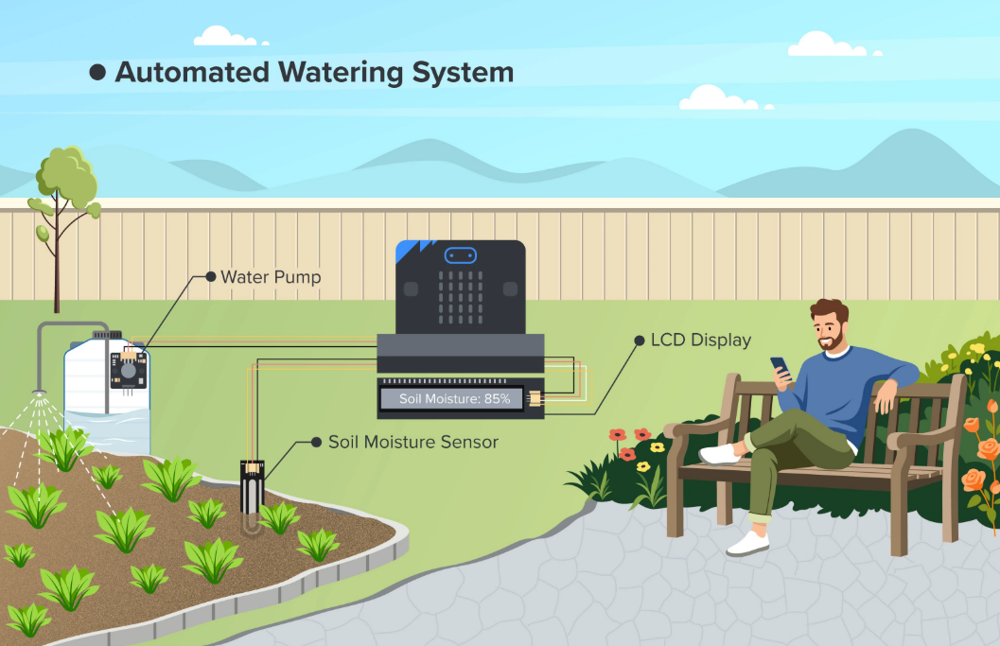

## Goal

Create an automatic irrigation system that will water the plant whenever the soil moisture sensor senses the lack of water in the soil.

## Background

<b>What is an Automatic Irrigation System?</b>

Automatic Irrigation System tracks the soil moisture in real time using a sensor without having to rely on our guesses. It will water the plant for you whenever the soil moisture gets dangerously low. This type of system is used in modern farming and increases the crop yield and consequently reduces the unnecessary use of water. 

<b>Automatic Irrigation System Operation</b>

The soil moisture sensor is embedded in the plant pot. Whenever the soil moisture gets low, the water pump is triggered, and pumps water through a tube that water the plant until the soil moisture level is satisfactory, upon which the pump stops. 

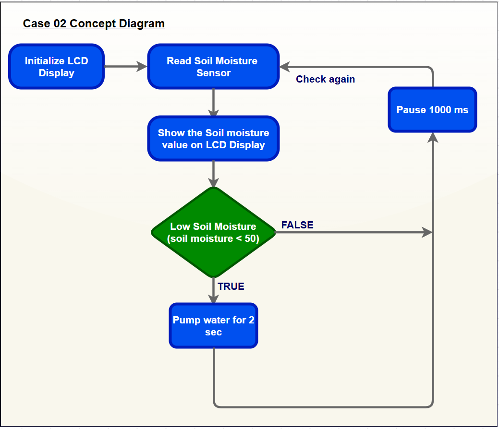

Know More: Why is Water Important for Plant Growth?

Water provides the hydrogen ions needed in photosynthesis to convert sunlight into energy. It also dissolves minerals from the soil and transports them through the plant's vascular system (xylem) to different parts of the plant, supporting overall growth.

Additionally, water maintains turgor pressure in cells, keeping plants upright and enabling cell expansion. It also helps cool the plant and prevent overheating through transpiration, a process in which water evaporates from the leaves.

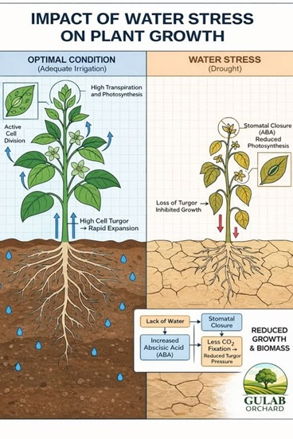

## Part List

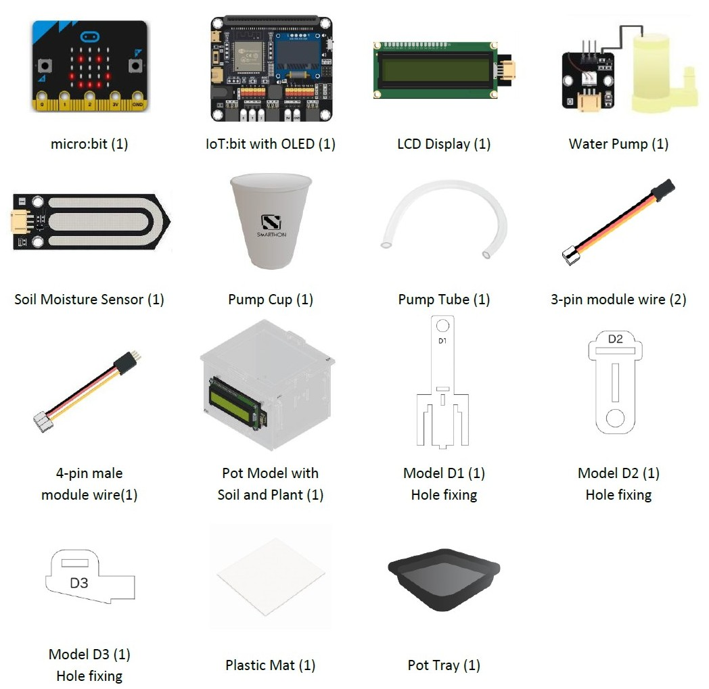

## Assembly Steps

Step 1 

To start with, build the plant pot model with soil and seedling. 

Step 2 

Assemble D1 with D3. 

Step 3 

Assemble D2 with the above part. 

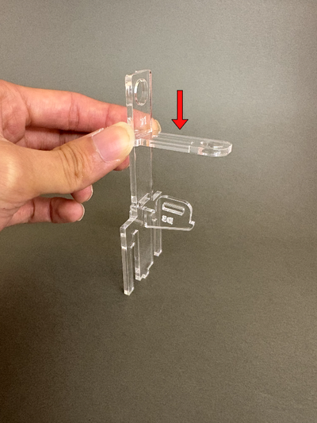

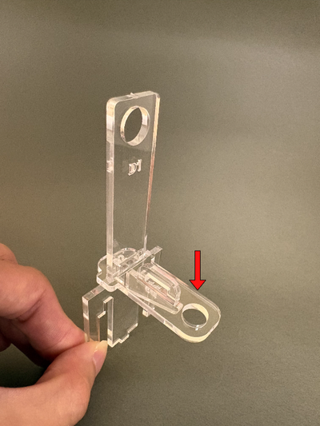

Step 4 

Fixed them with two F. Complete this part!. 

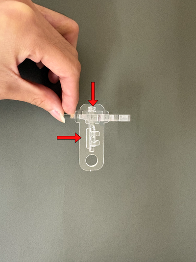

Step 5 

Combine the above part with the plant pot. 

Step 6 

Put the water pump into the pump cup, then insert the pump tube between D1 and D2 as shown in the picture. 

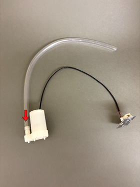

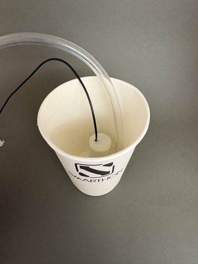

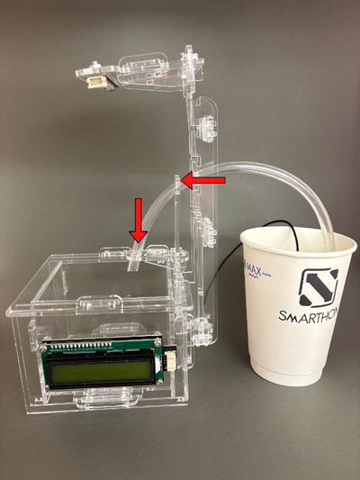

Step 7 

Put the soil moisture sensor into the soil. Complete! 

Points to Note 

Keep the water tube end higher than the water level in the cup to prevent the siphon effect, which causes water to flow uncontrollably to the plant.  

## Hardware Connection

1. Connect Soil Moisture Sensor to P1.  
2. Connect Water Pump to P2.  
3. Connect LCD Display to I2C.

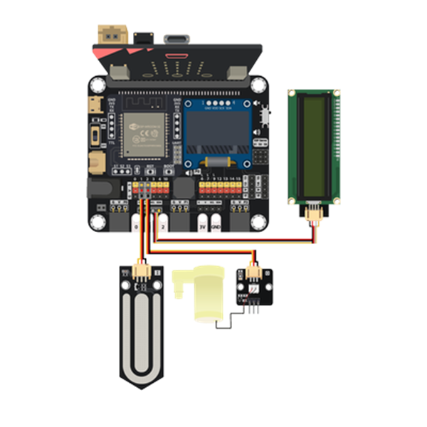

## Programming (MakeCode)

Step 1. Program Startup 

When the micro:bit powers on, it immediately configures the LCD display:

* Initialize Display: `initialize LCD at I2C` with connects and powers up the 16x2 LCD screen using the I2C communication protocol so it can output text.

Step 2: Reading Soil Moisture (forever loop) 

When the micro:bit powers on, it immediately configures the LCD display:

* Read Sensor: `set soilMoisture to soil moisture(0~100) at pin P1` with reads the analog signal from the soil moisture sensor connected to pin `P1` ,converts the reading into a percentage scale from 0 (completely dry) to `100` (completely wet) and stores this value inside the variable `soilMoisture`.

Step 3: Updating the Display (forever loop)
 

The micro:bit shows the live moisture reading on the screen::

* Show Moisture: `LCD show join "Soil Moisture:" soilMoisture at position 1 with length 16`
* Combines the text label `"Soil Moisture:"` with the live number saved in `soilMoisture`.
* Displays the combined text starting at `position 1` across a `length of 16 characters` on the screen.

Step 4: Automatic Watering Condition (forever loop)
 

The micro:bit evaluates whether the soil is dry and needs water:

* Check Moisture: `if soilMoisture < 50, then`
* Turn Pump On with `set water pump to intensity 1023 at P2 for 2 sec`
* If the moisture is below 50, it activates the water pump connected to `pin P2`.
* Sets the motor power to maximum speed `(intensity 1023)`.
* Keeps the pump running for `2 seconds` to water the plant.

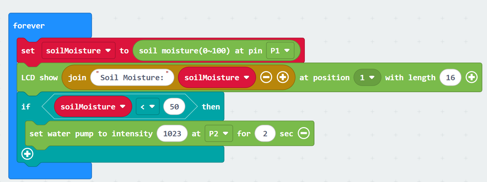

Step 5: Loop Delay (forever loop) 

The micro:bit pauses briefly before taking the next reading:

* Snap pause (ms) 1000

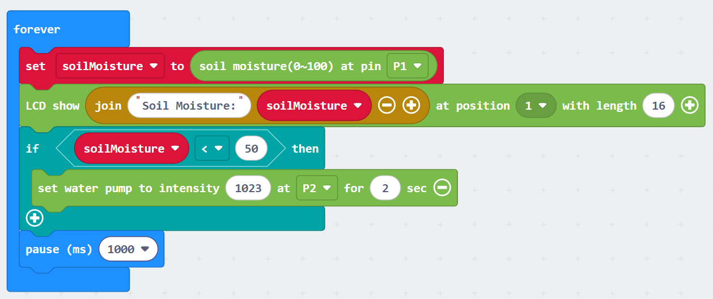

MakeCode: [https://makecode.microbit.org/_gDiRMXKwzXaf](https://makecode.microbit.org/_gDiRMXKwzXaf)   
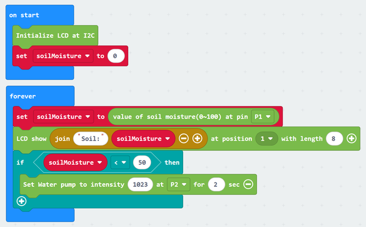

<H3><u>Advanced Usage: Pump water once every day</u></H3>

Step 1: Hour Tracking Clock (first forever loop)
 

A dedicated background loop keeps track of time throughout the day:

* 1-Hour Delay: `pause (ms) 3600000`with Delays for 3,600,000 milliseconds (exactly 1 hour).
* Increment Hour: `change hour by 1`with Adds 1 to the hour counter every hour.
* Midnight Reset: `if hour = 24 then set hour to 0`with Resets the clock to 0 (midnight) after reaching 24 hours.

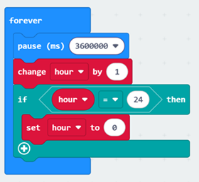

Step 2: Daily Watering Logic (second forever loop)
 

The system checks once per day at 8:00 AM if the soil needs water:

* Add the Time Check: `if hour = 8 then` with Checks if the current time is `8:00 AM (hour = 8)`
* Moisture Check: `if soilMoisture < 50 then` with Checks if the soil moisture level is below `50%`.
* Turn Pump ON: `set water pump to intensity 1023 at P2 for 2 sec with` If it is 8:00 AM and the soil is dry `(< 50)`, it activates the water pump connected to pin` P2` , Sets the motor power to maximum speed `(intensity 1023)` and Keeps the pump running for 2 seconds to water the plant.
* Pause Execution: `pause (ms) 1000` with delays for 1000 milliseconds (1 second) before restarting the loop.

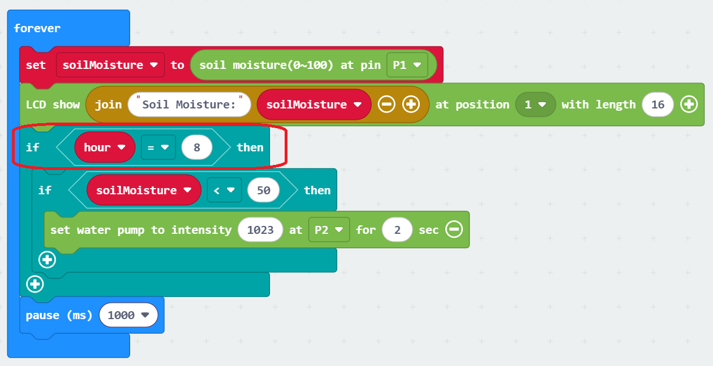

If every day at 8 am, it will check whether soil moisture sensor is low. If low, will pump water.
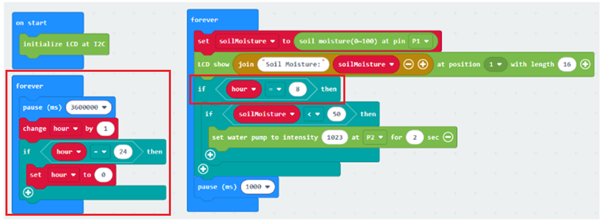

MakeCode: [https://makecode.microbit.org/_XXWT91M2vddr](https://makecode.microbit.org/_XXWT91M2vddr) 

## Result

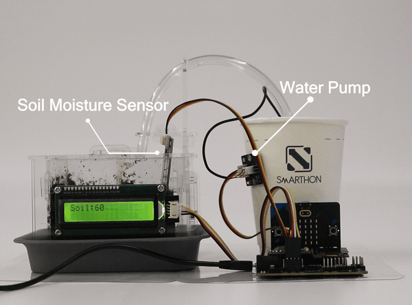

## Think

Q1. Why do you think we need to set a pause for the water pump function? Is it because of the plant or programming?

