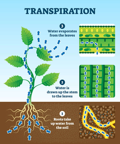
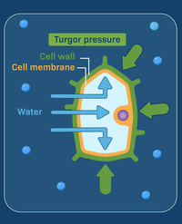
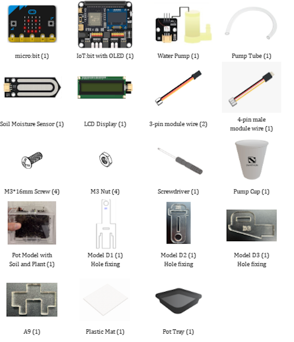
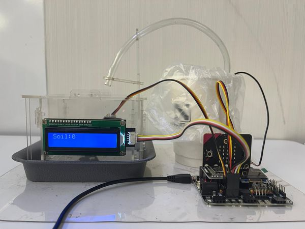

# Case 02: Automated Watering System

## Goal

Create an automatic irrigation system that will water the plant whenever the soil moisture sensor senses the lack of water in the soil.

## Background

<b>What is an Automatic Irrigation System?</b>

Automatic Irrigation System tracks the soil moisture in real time using a sensor without having to rely on our guesses. It will water the plant for you whenever the soil moisture gets dangerously low. This type of system is used in modern farming and increases the crop yield and consequently reduces the unnecessary use of water. 

<b>Automatic Irrigation System Operation</b>

The soil moisture sensor is embedded in the plant pot. Whenever the soil moisture gets low, the water pump is triggered, and pumps water through a tube that water the plant until the soil moisture level is satisfactory, upon which the pump stops. 

<b>Know More: Why is Water Important for Plant Growth?</b>

Water provides the hydrogen ions needed in photosynthesis to convert sunlight into energy. It also dissolves minerals from the soil and transports them through the plant's vascular system (xylem) to different parts of the plant, supporting overall growth.

Additionally, water maintains turgor pressure in cells, keeping plants upright and enabling cell expansion. It also helps cool the plant and prevent overheating through transpiration, a process in which water evaporates from the leaves.

  

## Part List

## Assembly Steps

Step 1 

To start with, build the plant pot model with soil and seedling. 

Step 2 

Assemble D1 with D3. 

Step 3 

Assemble D2 with the above part. 

Step 4 

Fixed them with two F. Complete this part!. 

Step 5 

Combine the above part with the plant pot. 

Step 6 

Put the water pump into the pump cup, then insert the pump tube between D1 and D2 as shown in the picture. 

Step 7 

Put the soil moisture sensor into the soil. Complete! 

Points to Note 

Keep the water tube end higher than the water level in the cup to prevent the siphon effect, which causes water to flow uncontrollably to the plant.  

## Hardware Connection

1. Connect Soil Moisture Sensor to P1.  
2. Connect Water Pump to P2.  
3. Connect LCD Display to I2C.

## Programming (MakeCode)

MakeCode: [https://makecode.microbit.org/\_fh8PjhV7cXPp](https://makecode.microbit.org/_fh8PjhV7cXPp)   

Advanced \- time control: [https://makecode.microbit.org/\_V0gEzw1bhDtH](https://makecode.microbit.org/_V0gEzw1bhDtH)   

## Result

## Think

Q1. Why do you think we need to set a pause for the water pump function? Is it because of the plant or programming?

