# Case 03: Intelligent Garden Lighting System

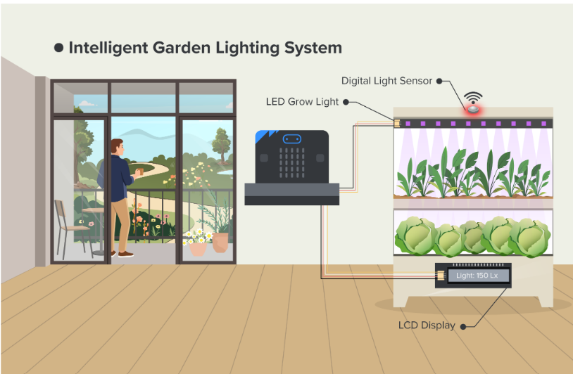

## Goal

Create an automatic grow light that will turn on when the light sensor detects the lack of appropriate amount of light.

## Background

<b>What is Smart LED Grow Light?</b>

Smart LED grow light helps the plant by tracking the lighting conditions and turning on whenever the plant needs more light. This type of system is incredibly useful in growing a plant in indoor conditions. 

<b>Smart LED Grow Light Operation</b>

We will use a light sensor to track the light intensity near the plant. Whenever the light intensity falls under a specific number, the board enables the LED to grow light that will shine on the plant. When we have enough light in the system, the LED will turn off. 

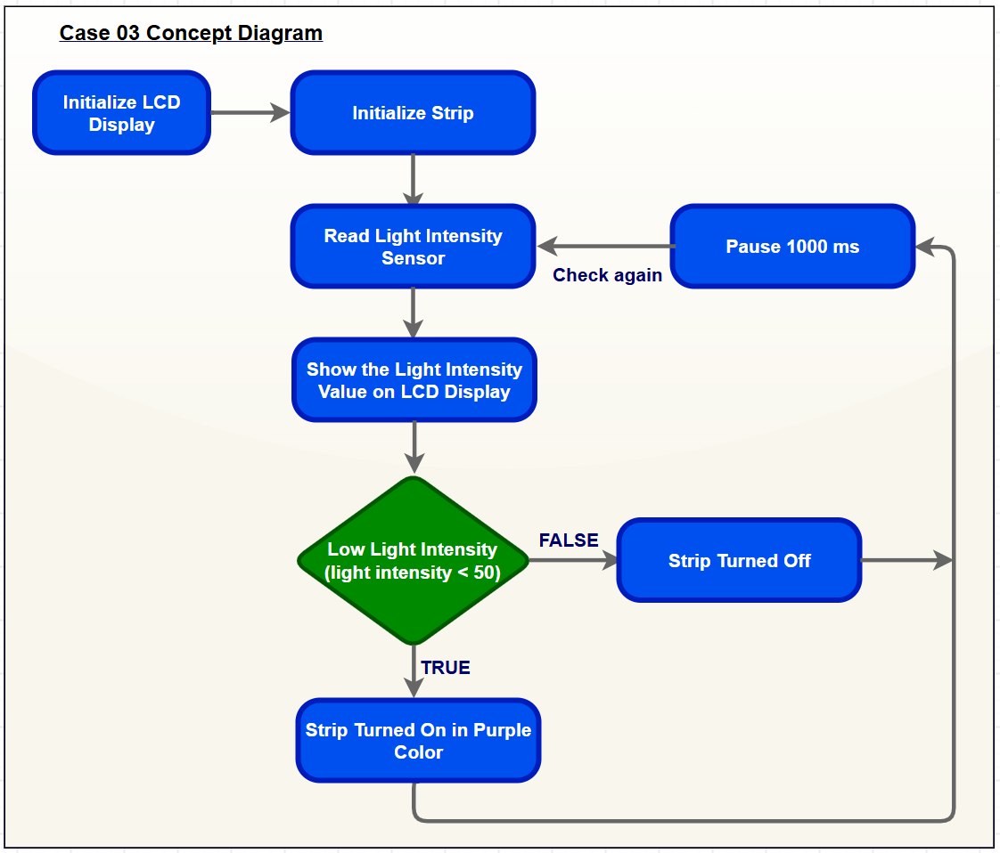

Know More: Why Is Light Important for Plant Growth?

Light drives photosynthesis, converting CO₂ and water into energy-rich sugars that provide nutrients for plant growth. It also regulates the growth of plants by influencing leaf expansion, root development and chlorophyll production through its intensity, duration and spectrum. Moreover, plants rely on daylight length to trigger key stages such as flowering, seed formation and dormancy. The existence of light ensures they grow in harmony with seasonal changes.

  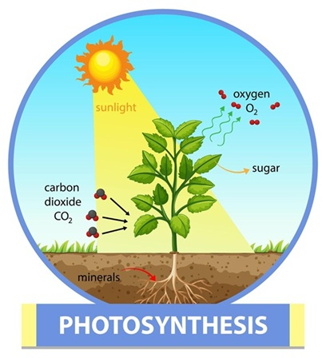

## Part List

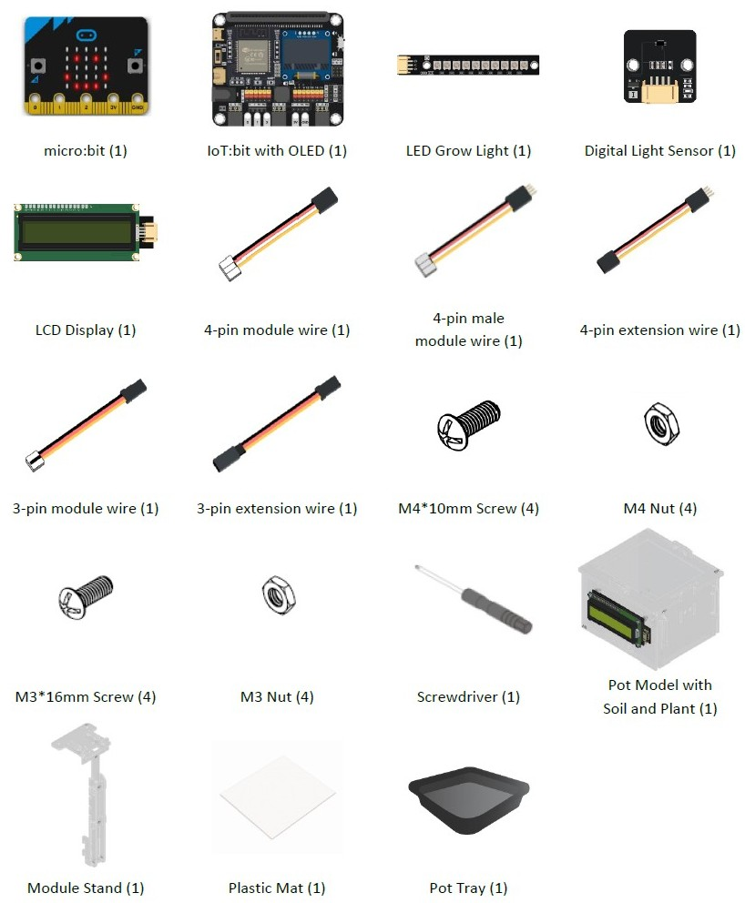

## Assembly Steps

Step 1 

To start with, build the plant pot model with soil and seedling. Install the LCD Display during the build. 

Step 2 

Connect the Module Stand with the Pot base. 

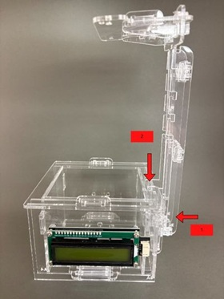

Step 3 

Connect the Digital Light Sensor with a 4-pin module wire and install it above part C1. 

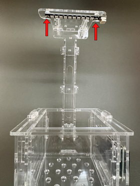

Step 4 

Connect the Digital Light Sensor with a 4-pin module wire and install it above part C1. 

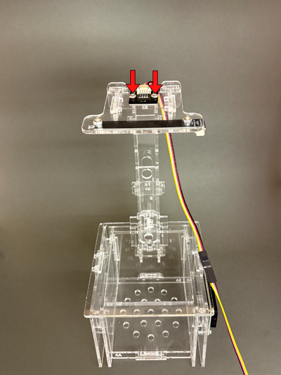

Step 5 

Put the model onto the pot tray and plastic mat. Completed! 

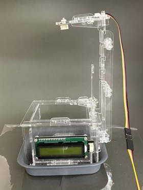

## Hardware Connection

1. Connect LED Grow Light to P2.  
2. Connect LCD Display to I2C.  
3. Connect Digital Light Sensor to I2C.

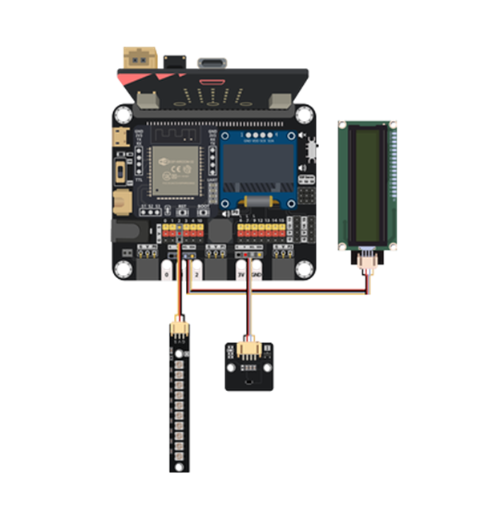

## Programming (MakeCode)

Step 1: Program Startup (on start) 

When the micro:bit powers on, it configures both the LCD display and the NeoPixel LED strip:

* Initialize Display: `initialize LCD at I2C` with Connects and powers up the 16x2 LCD screen using the I2C communication protocol so it can display text.
* Define LED Strip: `set strip to NeoPixel at pin P2 with 10 leds as RGB (GRB format)` with Configures a NeoPixel strip connected to pin `P2 with 10 LEDs` using standard GRB color format.

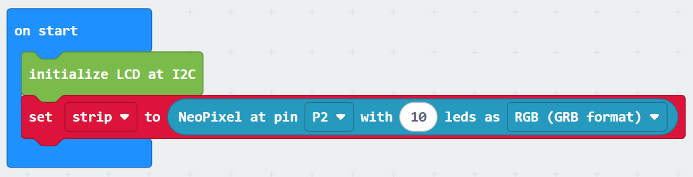

Step 2: Reading Light Level (forever loop) 

The micro:bit continuously reads the ambient brightness around the plant:

* Read Sensor: `set light to light intensity(Lx) from BH1750 at I2C` with reads the ambient light intensity in Lux (Lx) from the BH1750 digital light sensor connected via I2C and Stores this reading inside the variable `light`.

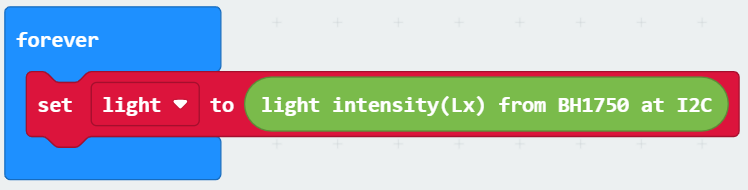

Step 3: Updating the Display (forever loop)
 

The micro:bit displays the live light reading on the screen:

* Show Light Level: `LCD show join "Light:" light at position 1 with length 16`with Combines the text label `"Light:"` with the live number saved in `light` and Displays the combined text starting at `position 1 across a length of 16 characters` on the screen..

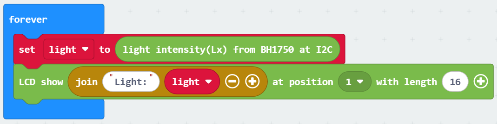

Step 4: Automatic Lighting Logic (forever loop) 

The micro:bit checks whether the surrounding environment is dark or bright:

* Check Condition: `if light < 50 then with` Checks if the current light level falls below 50 Lux.
* Turn Light Purple (If Dark): `strip show color purple` with If the room is dark (`light < 50`), all 10 LEDs turn Purple (acting as a grow light for the plant).
* Turn Light Off (If Bright): `else strip shows color black` with If the room is bright enough (light >= 50), the LED strip sets to `Black` (turns off to save energy).

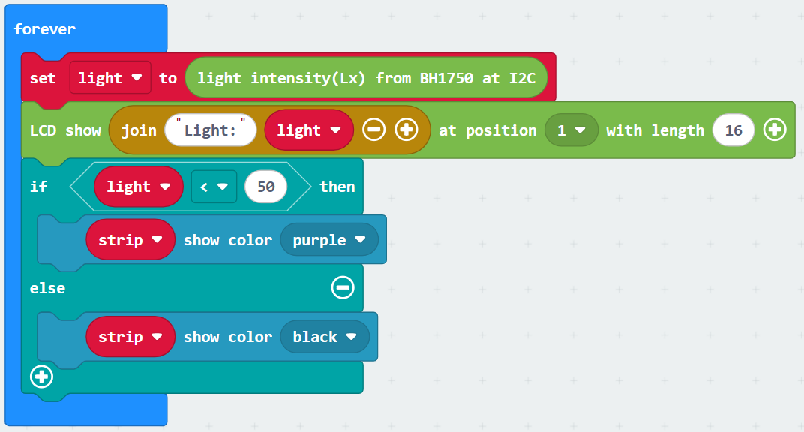

Step 5: Loop Delay (forever loop) 

The micro:bit pauses briefly before checking the sensor again:

* Pause Execution: `pause (ms) 1000` with delays for 1000 milliseconds (1 second) before restarting the loop from Step 2.

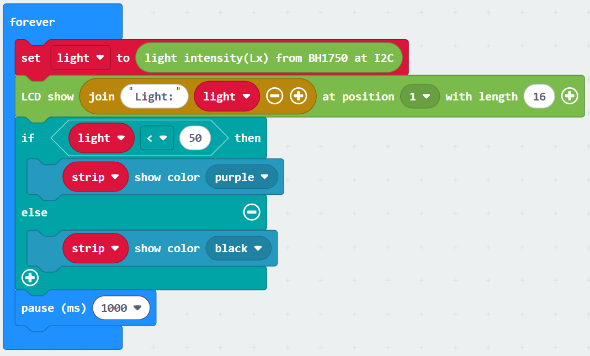

MakeCode: [https://makecode.microbit.org/_9Pc5t3HVYXzy](https://makecode.microbit.org/_9Pc5t3HVYXzy)   
  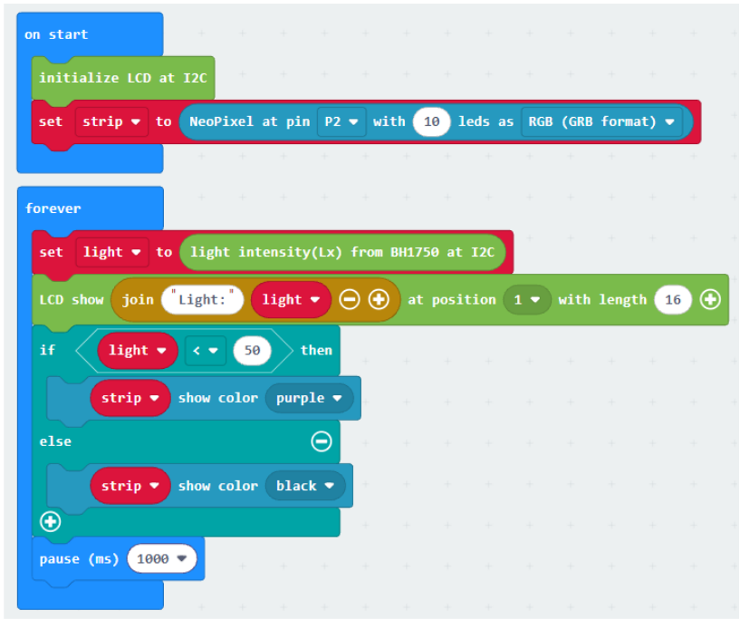

<H3><u>Advanced Usage: Turn on the light at least 12 hours every day</u></H3>

Step 1: Add Hour Tracking Clock (first forever loop) 

A dedicated loop keeps track of the time throughout the day:

* 1-Hour Delay: `pause (ms) 3600000` with waits 3,600,000 ms (exactly 1 hour).
* Increment Hour: `change hour by 1` with adds 1 to the hour counter every hour.
* Midnight Reset: `if hour = 24 then set hour to 0` with resets the clock to 0 (midnight) after reaching 24 hours.

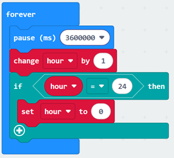

Step 2: Time & Light Logic (second forever loop)
 

The system checks if it is daytime before deciding to turn on the grow light:

* Daytime Window Check: `if hour >= 6 and hour < 18 then` with checks if the time is between 6:00 AM (`6`) and 6:00 PM (`18`) (Note: Change `18` to `19` if you need it to run until 7:00 PM).
* Light Threshold Check: `if light < 50 then` with if Dark During Day (`light < 50`): `strip show color purple` (turns grow light on) and if Bright During Day (`light >= 50`): `strip show color black` (turns grow light off).
* Nighttime Action: `else strip show color black` with during nighttime hours (before 6 AM or after 6 PM), the grow light stays off to maintain a night cycle for plants.
* Pause: `pause (ms) 1000` with waits 1 second before re-evaluating the light levels.

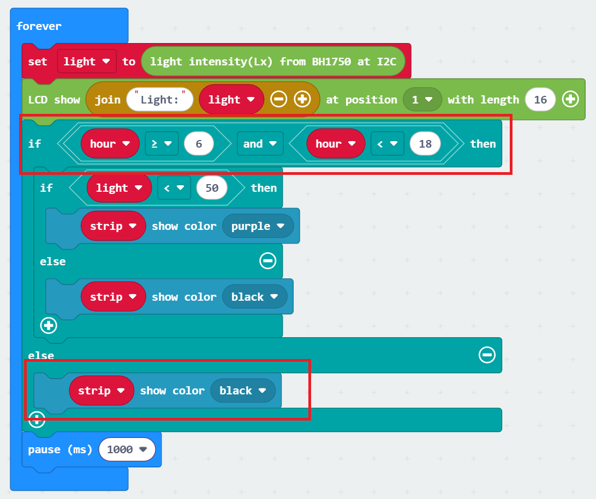

If every day at 6 am to 7 pm, it will check whether light intensity is high enough. If low, turn on the light. In the program below, please set your current hour to the variable in on start.

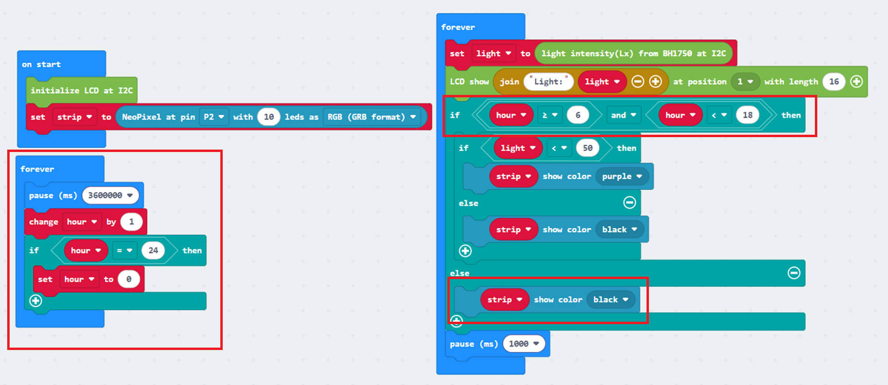

Makecode: [https://makecode.microbit.org/_2wDYCrAyVAsH](https://makecode.microbit.org/_2wDYCrAyVAsH)

## Result

  

