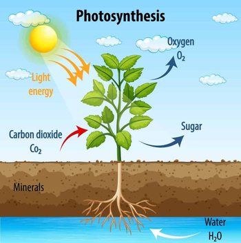
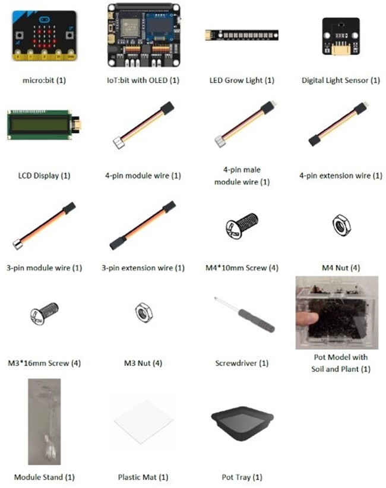

# Case 03: Intelligent Garden Lighting System

## Goal

Create an automatic grow light that will turn on when the light sensor detects the lack of appropriate amount of light.

## Background

<b>What is Smart LED Grow Light?</b>

Smart LED grow light helps the plant by tracking the lighting conditions and turning on whenever the plant needs more light. This type of system is incredibly useful in growing a plant in indoor conditions. 

<b>Smart LED Grow Light Operation</b>

We will use a light sensor to track the light intensity near the plant. Whenever the light intensity falls under a specific number, the board enables the LED to grow light that will shine on the plant. When we have enough light in the system, the LED will turn off. 

<b>Know More: Why Is Light Important for Plant Growth?</b>

Light drives photosynthesis, converting CO₂ and water into energy-rich sugars that provide nutrients for plant growth. It also regulates the growth of plants by influencing leaf expansion, root development and chlorophyll production through its intensity, duration and spectrum. Moreover, plants rely on daylight length to trigger key stages such as flowering, seed formation and dormancy. The existence of light ensures they grow in harmony with seasonal changes.

  

## Part List

## Assembly Steps

Step 1 

To start with, build the plant pot model with soil and seedling. Install the LCD Display during the build. 

Step 2 

Connect the Module Stand with the Pot base. 

Step 3 

Connect the Digital Light Sensor with a 4-pin module wire and install it above part C1. 

Step 4 

Connect the Digital Light Sensor with a 4-pin module wire and install it above part C1. 

Step 5 

Put the model onto the pot tray and plastic mat. Completed! 

## Hardware Connection

1. Connect LED Grow Light to P2.  
2. Connect LCD Display to I2C.  
3. Connect Digital Light Sensor to I2C.

## Programming (MakeCode)

MakeCode: [https://makecode.microbit.org/_9Pc5t3HVYXzy](https://makecode.microbit.org/_9Pc5t3HVYXzy)   
  

Optional: Turn on the light at least 12 hours every day

If every day at 6 am to 7 pm, it will check whether light intensity is high enough. If low, turn on the light. In the program below, please set your current hour to the variable in on start.

Makecode: [https://makecode.microbit.org/_2wDYCrAyVAsH](https://makecode.microbit.org/_2wDYCrAyVAsH)

## Result

  

