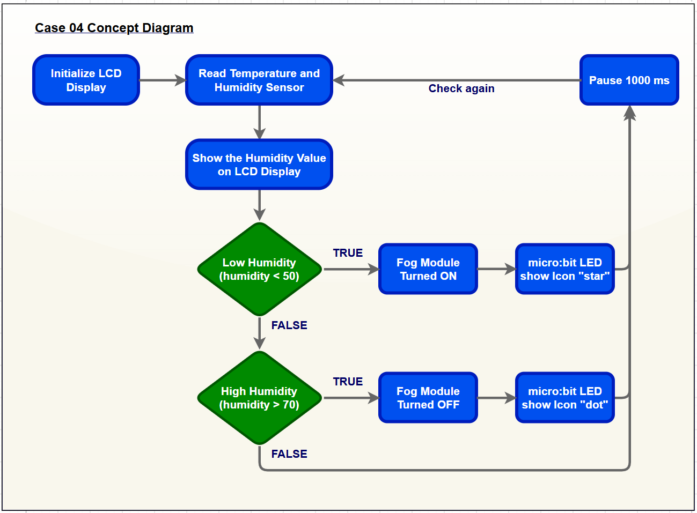
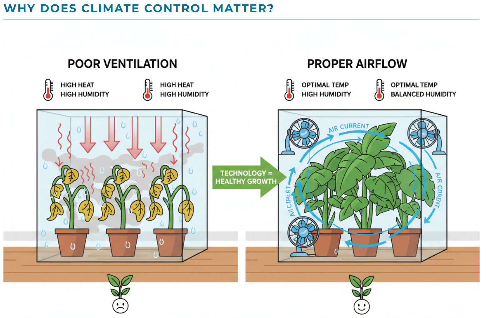
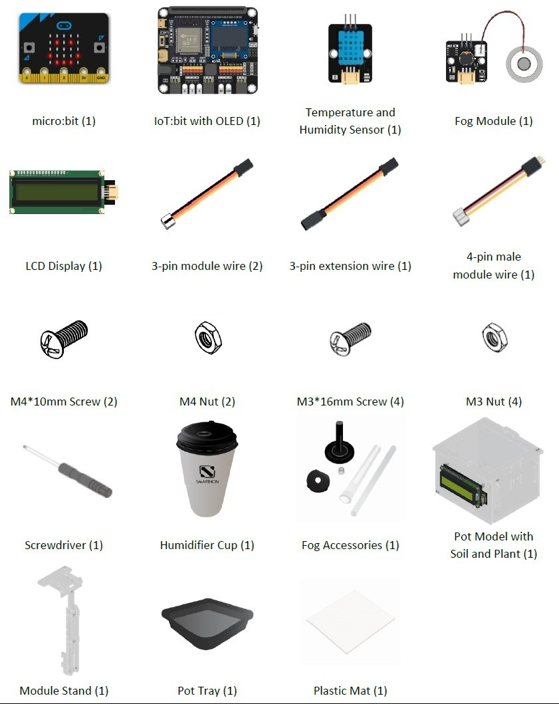
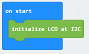
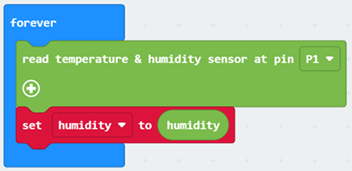
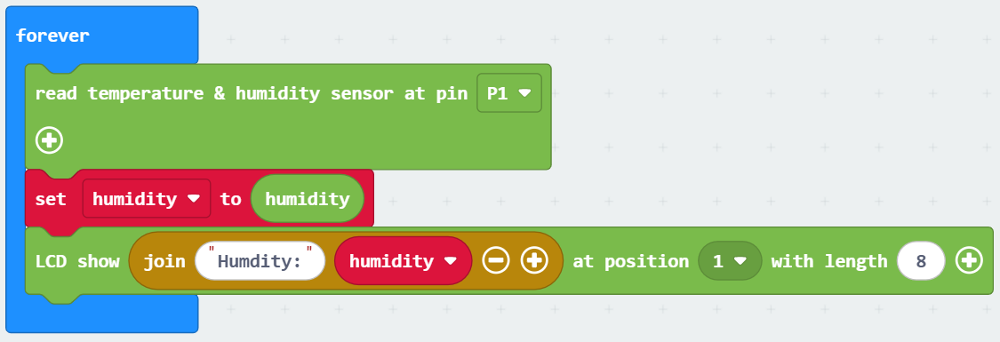
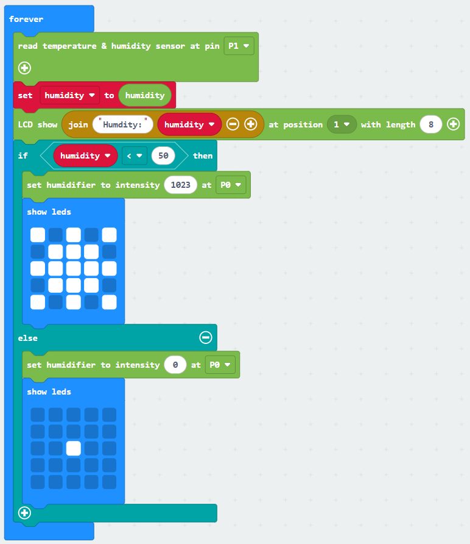
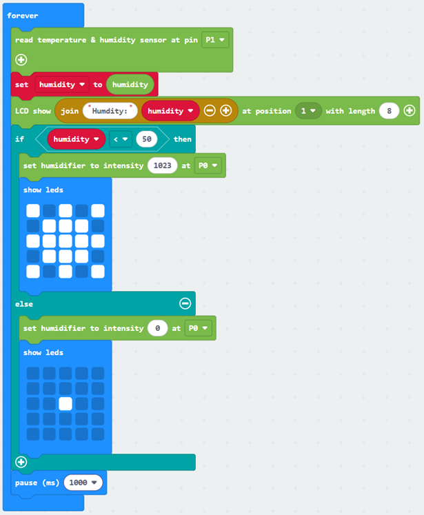
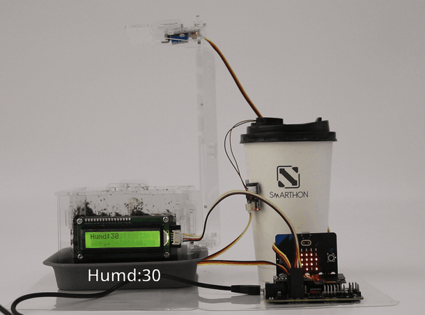

# Case 04: Smart Humidity Regulation

## Goal

Create an automatic system that humidifies the air whenever there is lack of it in the environment.

## Background

<b>What is an Automatic Humidity Control?</b>

The Automatic Humidity Control system measures humidity levels and efficiently adjusts the environment to the most favorable state for plant growth.

<b>Automatic Humidity Control Operation</b>

The LCD screen displays the humidity in the room. Whenever the humidity sensor detects the lack of humidity in the room the fog modules turn on. The led lights on microbit correspond to the operation of the fog module, starlike pattern when module is on, a single dot when the module is off. Whenever the humidity in the room rises to the appropriate level, the fog module turns off. 

Know More: Why is Humidity Control Important for Plant Growth?

Humidity control is crucial for plant growth because it directly affects transpiration, nutrient uptake and disease prevention.

Plants lose water through tiny leaf pores called stomata. Optimal humidity (typically 40-70%) keeps these pores open for efficient gas exchange and photosynthesis while preventing excessive water loss that stresses the plant. 

Too high humidity promotes fungal diseases like mold, while too low causes wilting and stunted growth by limiting cell expansion. By maintaining ideal levels, growers ensure healthy development, faster growth rates and higher yields in controlled environments like greenhouses.

## Part List

## Assembly Steps

Step 1 

To start with, build the plant pot model with soil and seedling. Install the LCD Display during the build. 

Step 2 

Connect the Module Stand with the Pot base. 

Step 3 

Connect the Temperature and Humidity Sensor with a 3-pin module wire and install it under part C1. 

Step 4 

Install the Fog Module and Fog Accessories as shown in the pictures. 

Step 5 

Put the Fog Module and Fog Accessories components into the Humidifier Cup. 

Step 6 

Put the model onto the pot tray and plastic mat. Completed! 

## Hardware Connection

1. Connect Fog Module to P0.  
2. Connect Temperature and Humidity Sensor to P1.  
3. Connect LCD Display to I2C.

## Programming (MakeCode)

Step 1: Program Startup (on start) 

When the micro:bit powers on, it configures the display:

* Initialize Display: `initialize LCD at I2C` with connects and powers up the 16x2 LCD screen using the I2C communication protocol so it can display text.

Step 2: Reading Humidity (forever loop) 

The micro:bit continuously reads data from the environmental sensor:

* Read Sensor: `Read temperature & humidity sensor at pin P1` with triggers the DHT sensor connected to pin P1 to measure current room conditions.
* Store Humidity Value: `set humidity to humidity` with takes the relative humidity percentage reading and saves it inside the variable `humidity`.

Step 3: Updating the Display (forever loop)
 

The micro:bit displays the live humidity percentage on the screen:

* Show Humidity: `LCD show join "Humidity:" humidity at position 1 with length 8` with combines the text label `"Humidity:"` with the live value saved in `humidity` and displays the text starting at `position 1` with a `length of 8 characters` on the screen.

Step 4: Automatic Humidifier Logic (forever loop) 

The micro:bit evaluates the humidity level to control the humidifier on pin P0 and update the 5 x 5 micro:bit LED screen:

* Low Humidity Condition: `if humidity < 50 then`
* Turn Humidifier ON: `set humidifier to intensity 1023 at P0` (activates the humidifier on pin P0 at full power).
* Display Active Icon: `show leds` (displays a diamond/water drop pattern on the micro:bit matrix indicating active humidifying).
* Normal / High Humidity Condition: `else`
* Turn Humidifier OFF: `set humidifier to intensity 0 at P0` (shuts off the humidifier on pin P0).
* Display Standby Icon: `show leds` (displays a single center dot on the micro:bit matrix indicating standby mode).

Step 5: Loop Delay (forever loop) 

The micro:bit pauses briefly before checking the sensor again:

* Pause Execution: `pause (ms) 1000` with delays for 1000 milliseconds (1 second) before restarting the loop from Step 2.

MakeCode: [https://makecode.microbit.org/_20Y9w4CWTKjm](https://makecode.microbit.org/_20Y9w4CWTKjm)   

## Result

