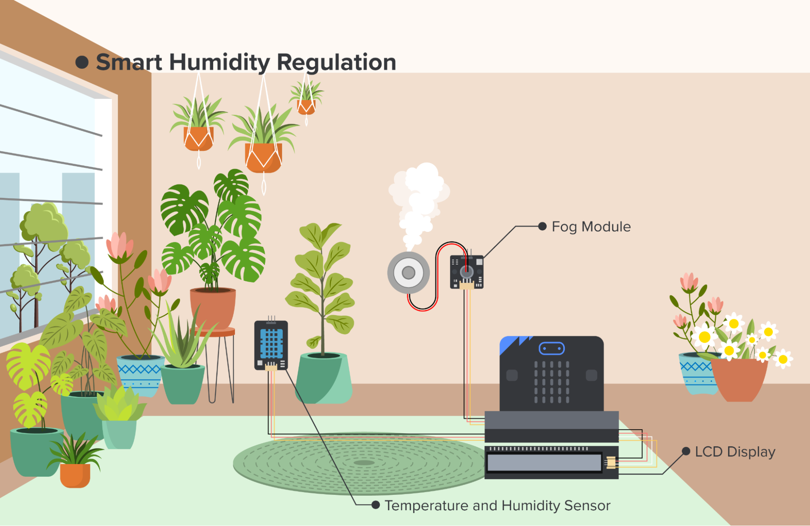
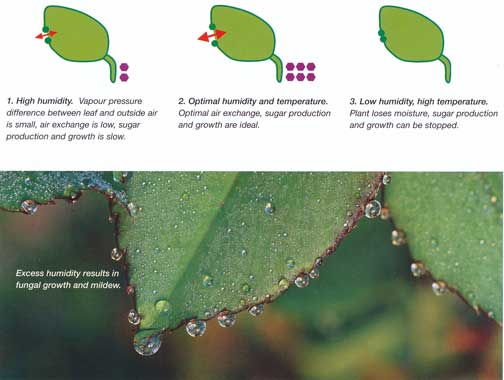
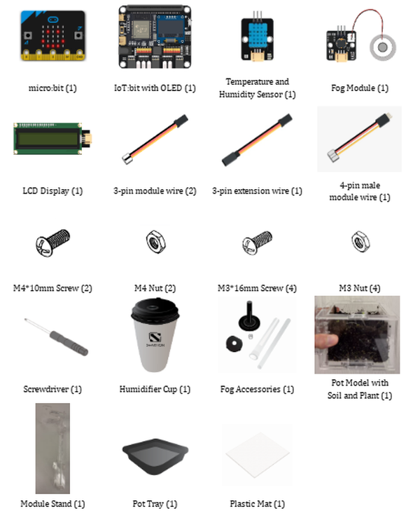
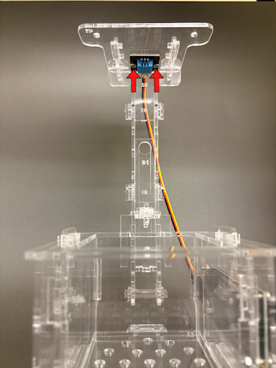
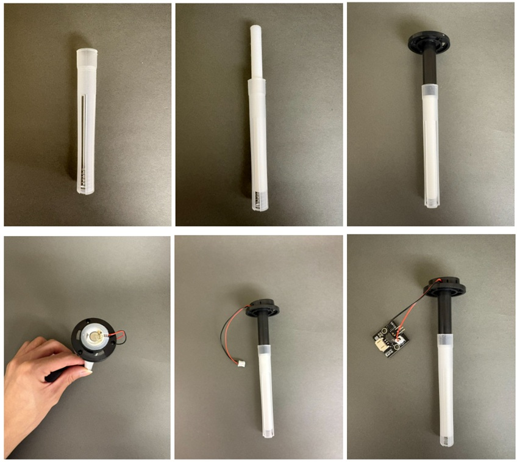
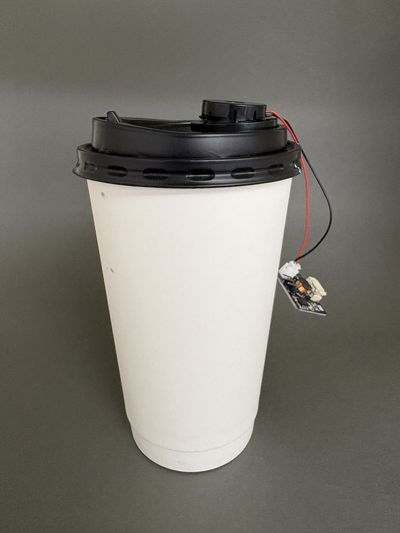
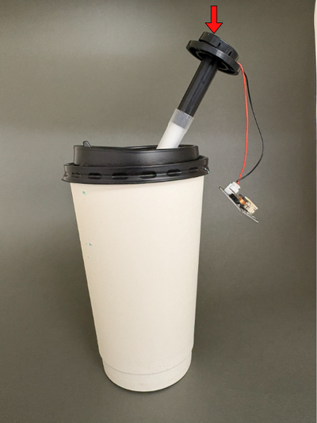
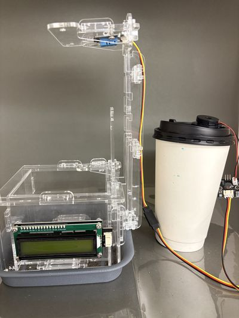
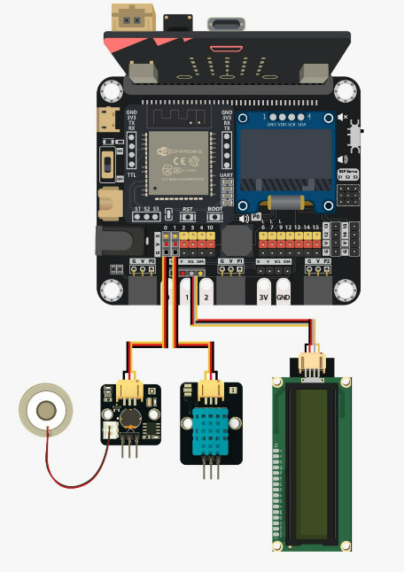
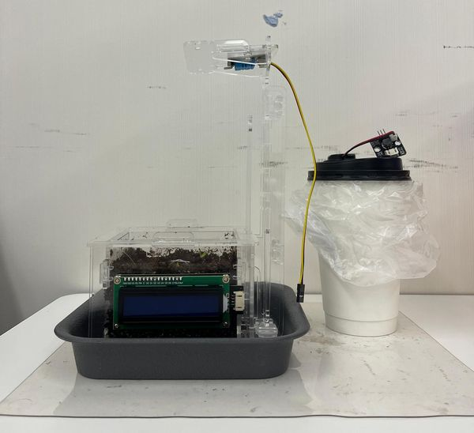

# Case 04: Smart Humidity Regulation

## Goal

Create an automatic system that humidifies the air whenever there is lack of it in the environment.

## Background

<b>What is an Automatic Humidity Control?</b>

The Automatic Humidity Control system measures humidity levels and efficiently adjusts the environment to the most favorable state for plant growth.

<b>Automatic Humidity Control Operation</b>

The LCD screen displays the humidity in the room. Whenever the humidity sensor detects the lack of humidity in the room the fog modules turn on. The led lights on microbit correspond to the operation of the fog module, starlike pattern when module is on, a single dot when the module is off. Whenever the humidity in the room rises to the appropriate level, the fog module turns off. 

<b>Know More: Why is Humidity Control Important for Plant Growth?</b>

Humidity control is crucial for plant growth because it directly affects transpiration, nutrient uptake and disease prevention.

Plants lose water through tiny leaf pores called stomata. Optimal humidity (typically 40-70%) keeps these pores open for efficient gas exchange and photosynthesis while preventing excessive water loss that stresses the plant. 

Too high humidity promotes fungal diseases like mold, while too low causes wilting and stunted growth by limiting cell expansion. By maintaining ideal levels, growers ensure healthy development, faster growth rates and higher yields in controlled environments like greenhouses.

## Part List

## Assembly Steps

Step 1 

To start with, build the plant pot model with soil and seedling. Install the LCD Display during the build. 

Step 2 

Connect the Module Stand with the Pot base. 

Step 3 

Connect the Temperature and Humidity Sensor with a 3-pin module wire and install it under part C1. 

Step 4 

Install the Fog Module and Fog Accessories as shown in the pictures. 

Step 5 

Put the Fog Module and Fog Accessories components into the Humidifier Cup. 

Step 6 

Put the model onto the pot tray and plastic mat. Completed! 

## Hardware Connection

1. Connect Fog Module to P0.  
2. Connect Temperature and Humidity Sensor to P1.  
3. Connect LCD Display to I2C.

## Programming (MakeCode)

MakeCode: [https://makecode.microbit.org/\_1hKYuFTH7Rri](https://makecode.microbit.org/_1hKYuFTH7Rri)   

## Result

