# IoT Case 05: Garden Environment Data Monitoring

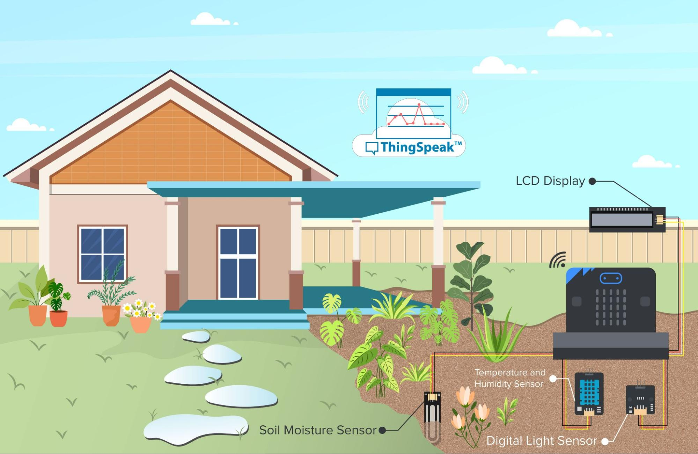

## Goal

Create a plant health monitoring system that will track the environment's humidity, temperature, light intensity and the plant’s soil moisture. The data is then sent and stored in thingspeak where it can be remotely monitored and analyzed over long periods of time. 

## Background

<b>What is Plant Health Data Monitoring?</b>

Monitoring plant data is immensely important. However, if you will only monitor the immediate data you risk not seeing the bigger picture. If you have the habit of measuring and recording plant data over long periods of time it can show you patterns that you could have easily missed. Maybe there is a consistent overtime degradation of the plant health that is not noticeable in day-to-day life. Or there is a sudden growth spurt and you want to study what caused it. Moreover, if you implement a system that will categorize and sort the data automatically into easy to analyze graphs, it can greatly increase your efficiency as a botanist as well as save you enormous amounts of time. 

<b>Plant Health Data Monitoring Operation</b>

The pot is mounted with three modules: temperature and humidity sensor, soil moisture sensor, light intensity sensor. The board attempts to connect to the internet, and if it is connected successfully the sensor readings are sent to thingspeak. Afterwards there is a 15 second break. After the break, the cycle repeats.

## Part List

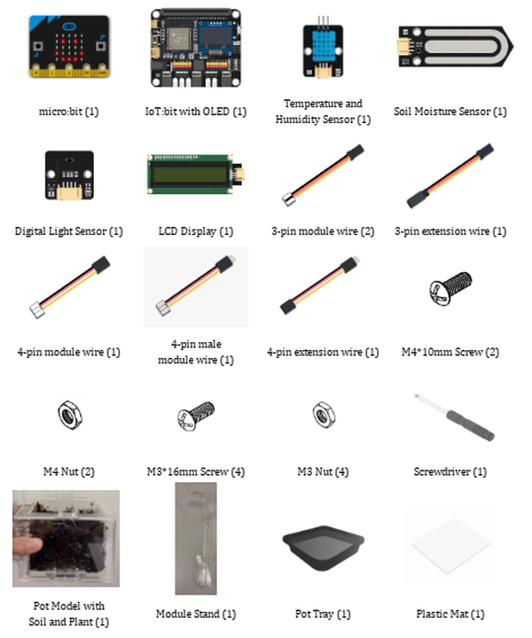

## Assembly Steps

Step 1 

To start with, build the plant pot model with soil and seedling. Install the LCD Display during the build. 

Step 2 

Connect the Module Stand with the Pot base. 

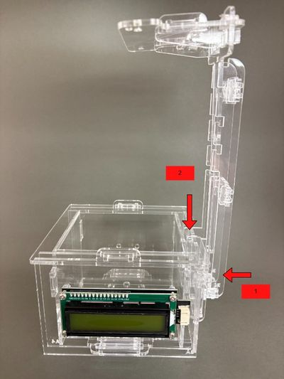

Step 3 

Connect the Temperature and Humidity Sensor and Digital Light Sensor with a 3-pin and 4-pin module wire, respectively. Install them on part C1, with the Digital Light Sensor above and the Temperature Humidity Sensor below the part. 

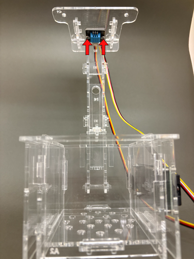

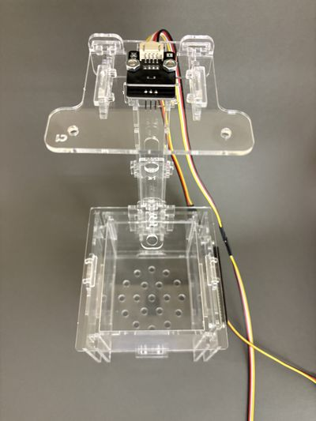

Step 4 

Connect the soil moisture sensor with a 3-pin module wire and put it into the soil. 

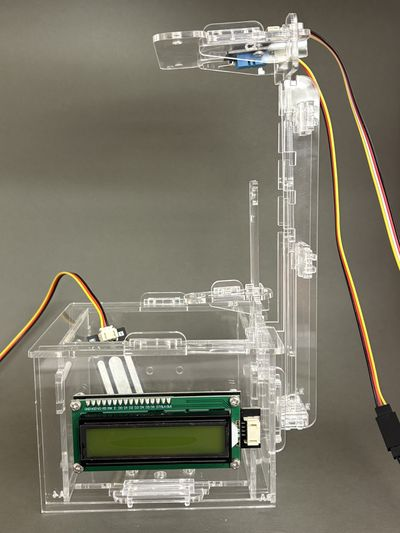

Step 5 

 Put the model onto the pot tray and plastic mat. Completed! 

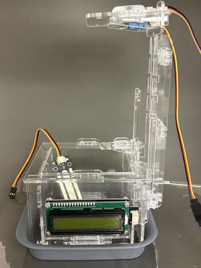

## Hardware Connection

1. Connect Temperature and Humidity Sensor to P1.  
2. Connect Soil Moisture Sensor to P2.  
3. Connect LCD Display to I2C.  
4. Connect Digital Light Sensor to I2C.

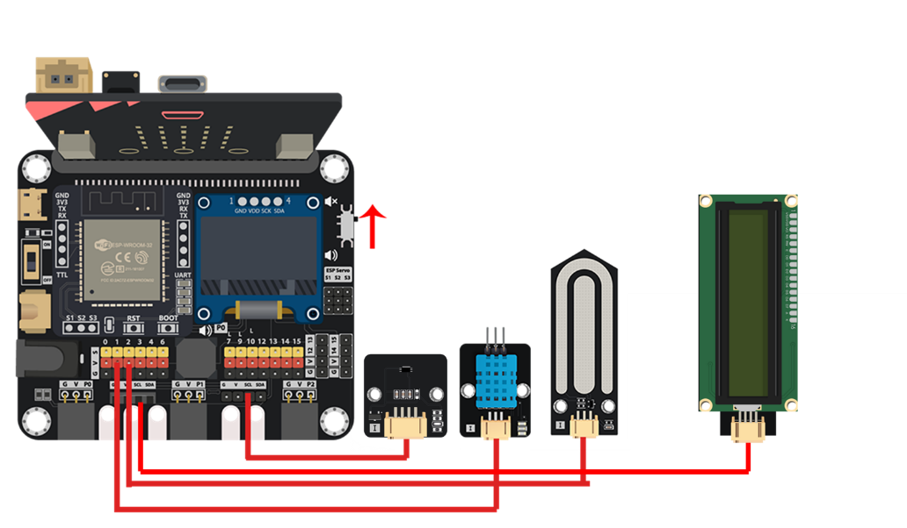

## Programming (MakeCode)

MakeCode: [https://makecode.microbit.org/\_bRoabr5MFWD5](https://makecode.microbit.org/_bRoabr5MFWD5)   
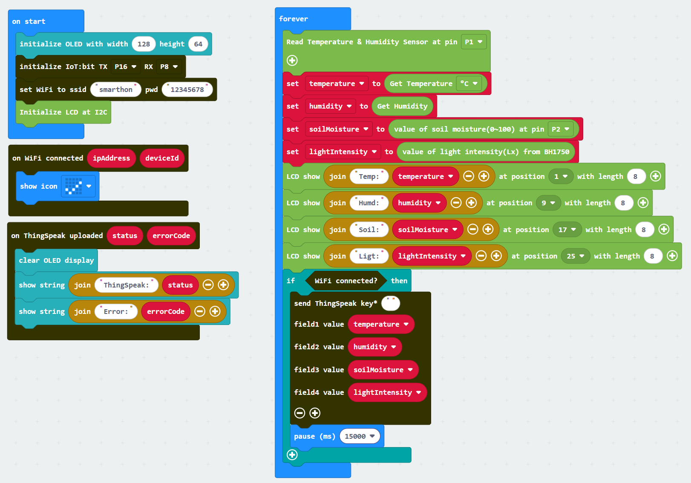

## IoT (ThingSpeak)

1. Go to https://thingspeak.com, Choose Channels \-\> My Channels \-\> New Channel

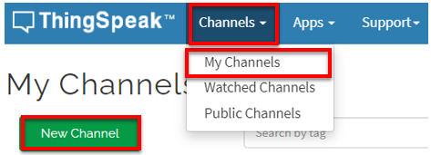

2. Input Channel name, Field 1-4, then click “Save Channel”  

* Channel name: Smart Garden Monitoring  

* Field 1: temperature  

* Field 2: humidity  

* Field 3: soil moisture  

* Field 4: light intensity

3. Select your channel \> “API Keys”, copy the API key as follows:

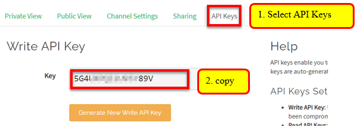

## Result

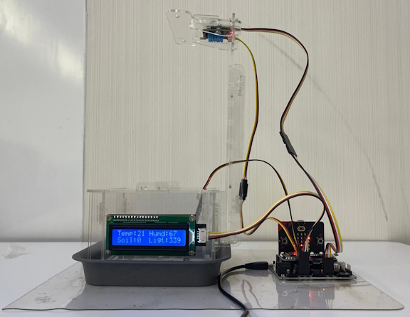

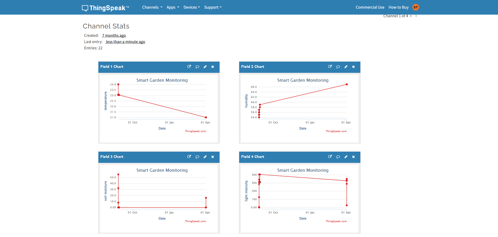

