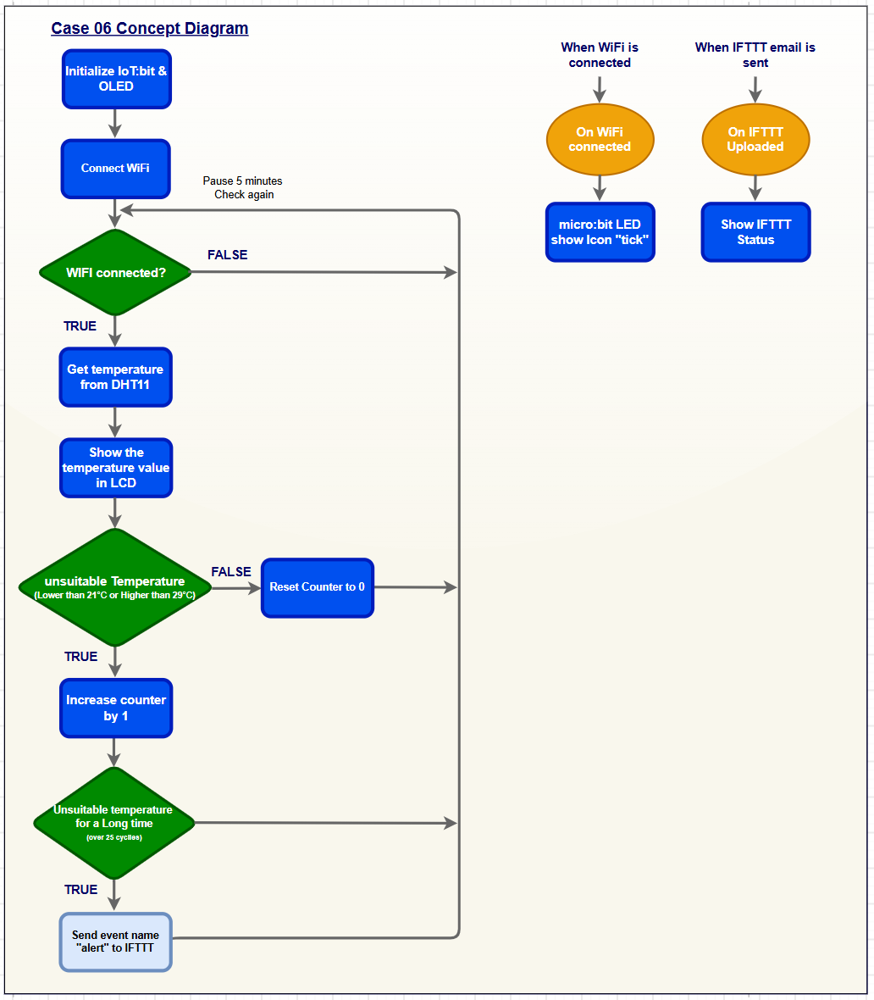
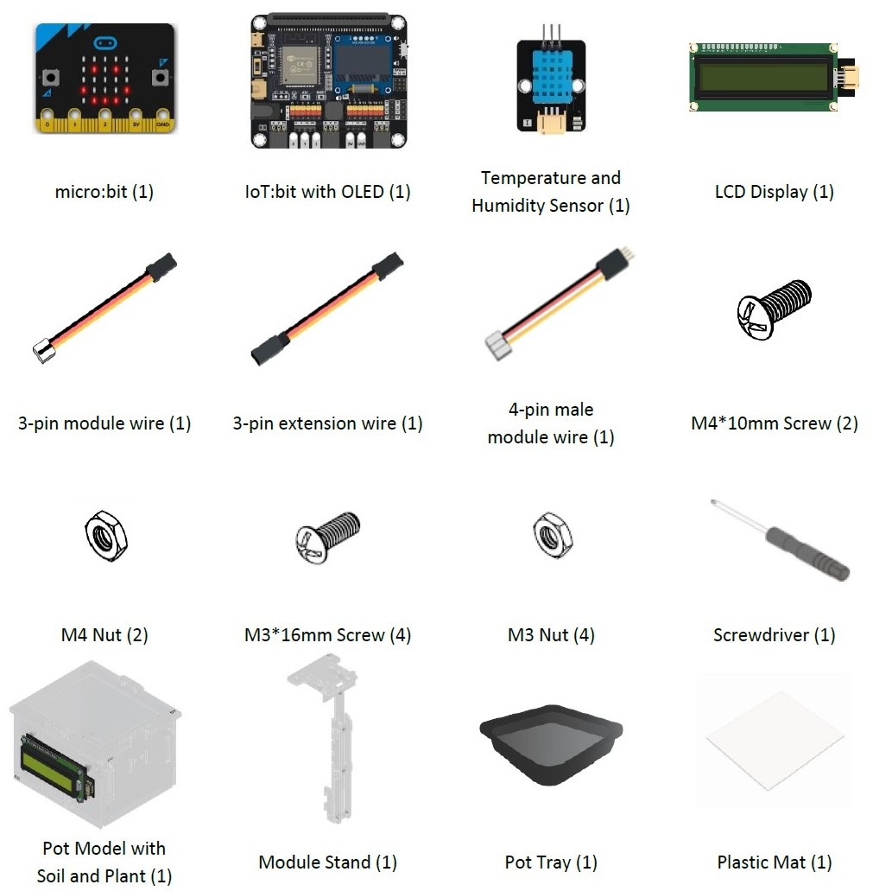
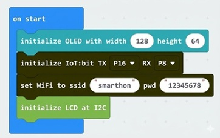
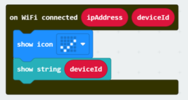
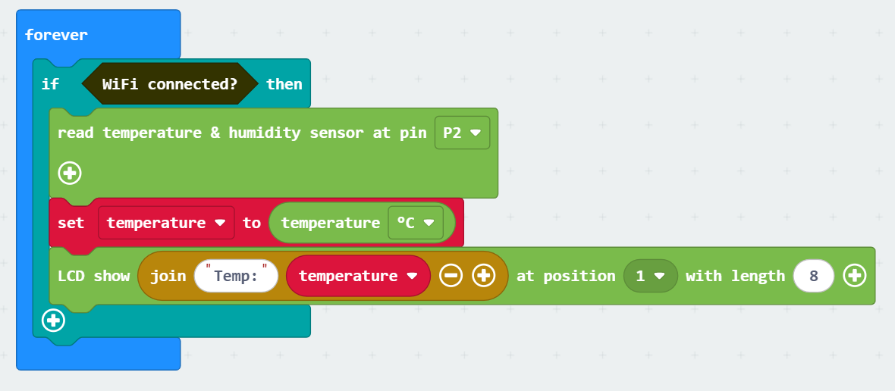
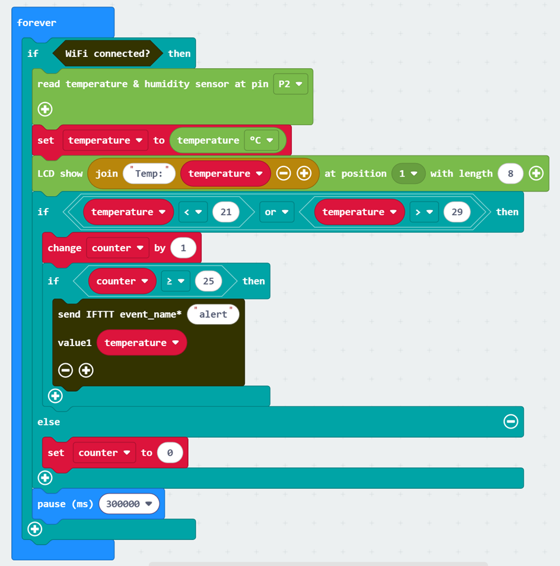
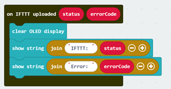
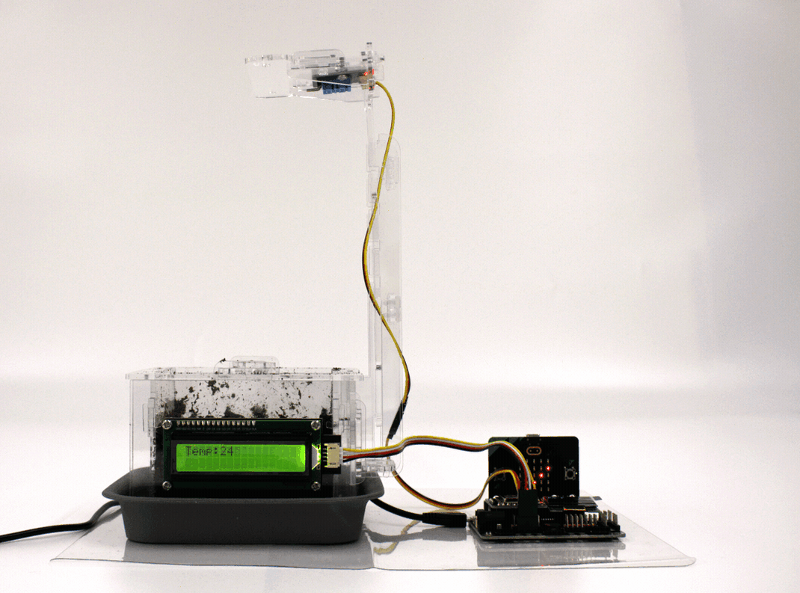

# IoT Case 06: Environmental Anomaly Alert

## Goal

Create  an email alert system that automatically notifies you when the environmental temperature falls outside the optimal range for plant growth.

## Background

<b>What is an Environmental Anomaly Alert?</b>

An Environmental Anomaly Alert is a monitoring system designed to detect abnormal environmental conditions that may affect plant growth. It ensures that factors such as temperature and humidity remain within the ideal range for healthy plant development. When irregularities occur, the system notifies the user so that timely actions can be taken to restore optimal growing conditions.

<b>Environmental Anomaly Alert Operation</b>

The IoT board connects to a Wi-Fi network and uses a temperature and humidity sensor to monitor environmental conditions continuously. The current temperature readings are displayed on the OLED screen every 30 seconds. If the temperature stays outside the normal range for more than 25 cycles, the system triggers a signal to an IFTTT applet. This applet then sends an email notification to the user’s specified address and continues sending alerts until the temperature returns to the normal range.

## Part List

## Assembly Steps

Step 1 

To start with, build the plant pot model with soil and seedling. Install the LCD Display during the build. 

Step 2 

Connect the Module Stand with the Pot base. 

Step 3 

Connect the Temperature and Humidity Sensor and Digital Light Sensor with a 3-pin and 4-pin module wire, respectively. Install them on part C1. 

Step 4 

Put the model onto the pot tray and plastic mat. Completed! 

## Hardware Connection

1. Connect Temperature and Humidity Sensor to P2.  
2. Connect LCD Display to I2C.

## Programming (MakeCode)

Step 1:Initialize OLED, LCD, IoT:bit and connect to WiFi 

* Snap Initialize OLED with width:128, height: 64 to on start
* Snap Set Wi-Fi to ssid pwd from IoT:bit
* Enter your Wi-Fi name and password. Here we set smarthon as SSID and 12345678 as password
* Snap initialize LCD at I2C with connects and powers up the 16x2 LCD screen using the I2C communication protocol so it can display text.

Step 2: Show icon “tick”  and device ID after WiFi connection 

* In On WiFi connected, put a show icon tick get notice after WiFi is connected
* Show string deviceID after show icon tick

Step 3: Read the data, set variable and show the data 

* In forever, put a if statement and use WiFi connect? as condition
* Read the data by read temperature & humidity sensor at pin P2
* Set the variable to get the value, which is temperature
* LCD show join Temp: temperature for temperature

Step 4: Examine the light intensity value and reaction 

* Snap a nested if statement under the LCD show
* Set temperature < 21 or temperature > 29 as the condition
* Set the variable counter and change counter by 1 under the condition
* Snap an if statement under the change counter
* Set counter >= 25 as condition
* Send the data to Thingspeak by Send Thingspeak key XXXX field1 value XXX ..., fill in the write API key from the Thingspeak channel and the values need to be upload
* If temperature in the range 21-29, set counter to 0
* Wait for 300 second to avoid upload too frequently by pause(ms) 300000, then start another Reading and uploading

Step 5: Check Thingspeak upload status 

* To check the uploading status, use On thingspeak Uploaded to get the uploading result
* Insert clear OLED display for better visual effect
* Use the Status and Error_code from block placeholder respectively to showing some text explanation
* show string join Thingseak: Status for Upload status
* show string join Error: Error_code for Error code if upload failed

MakeCode: [https://makecode.microbit.org/\_f1EWY3VVEF9T](https://makecode.microbit.org/_f1EWY3VVEF9T)   

## IoT (IFTTT)

1. Go to [https://ifttt.com](https://ifttt.com), register an account and login to the platform.

2. On the top right menu, click “Create”.

3. Create tigger by:  

* Select “This”.  

* Select Smarthon IoT (micro:bit).  

* Select “IoT:bit was triggered”.  

* Input IoT:bit’s device ID and Trigger Command “alert”.  

* Click “Create trigger”.

4. Create action by: 
 
* Select “That”.  

* Select Email.  

* Select “Send me an email”.  

* Input email Subject and Body.  

* Click “Create action”.

## Result

