# IoT Case 06: Environmental Anomaly Alert

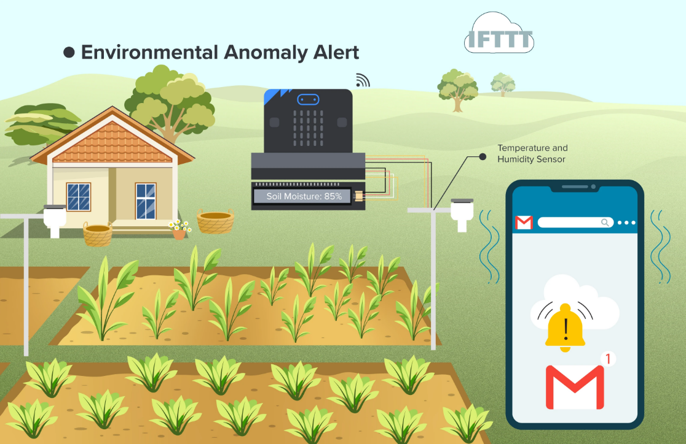
## Goal

Create  an email alert system that automatically notifies you when the environmental temperature falls outside the optimal range for plant growth.

## Background

<b>What is an Environmental Anomaly Alert?</b>

An Environmental Anomaly Alert is a monitoring system designed to detect abnormal environmental conditions that may affect plant growth. It ensures that factors such as temperature and humidity remain within the ideal range for healthy plant development. When irregularities occur, the system notifies the user so that timely actions can be taken to restore optimal growing conditions.

<b>Environmental Anomaly Alert Operation</b>

The IoT board connects to a Wi-Fi network and uses a temperature and humidity sensor to monitor environmental conditions continuously. The current temperature readings are displayed on the OLED screen every 30 seconds. If the temperature stays outside the normal range for more than 25 cycles, the system triggers a signal to an IFTTT applet. This applet then sends an email notification to the user’s specified address and continues sending alerts until the temperature returns to the normal range.

## Part List

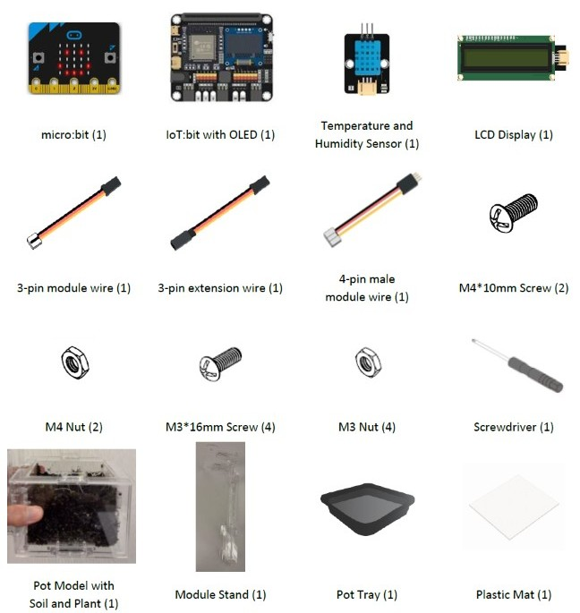

## Assembly Steps

Step 1 

To start with, build the plant pot model with soil and seedling. Install the LCD Display during the build. 

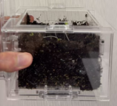

Step 2 

Connect the Module Stand with the Pot base. 

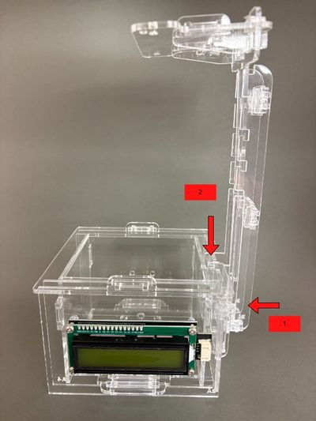

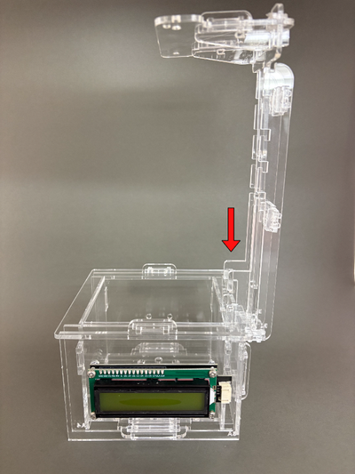

Step 3 

Connect the Temperature and Humidity Sensor and Digital Light Sensor with a 3-pin and 4-pin module wire, respectively. Install them on part C1. 

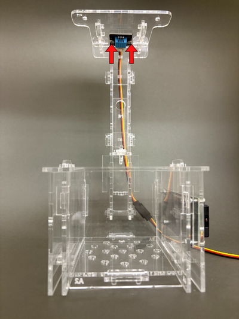

Step 4 

Put the model onto the pot tray and plastic mat. Completed! 

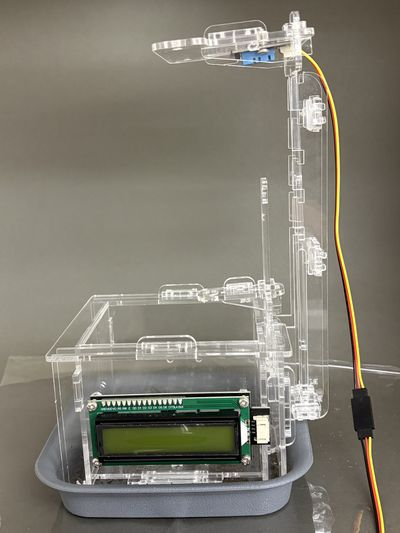

## Hardware Connection

1. Connect Temperature and Humidity Sensor to P2.  
2. Connect LCD Display to I2C.

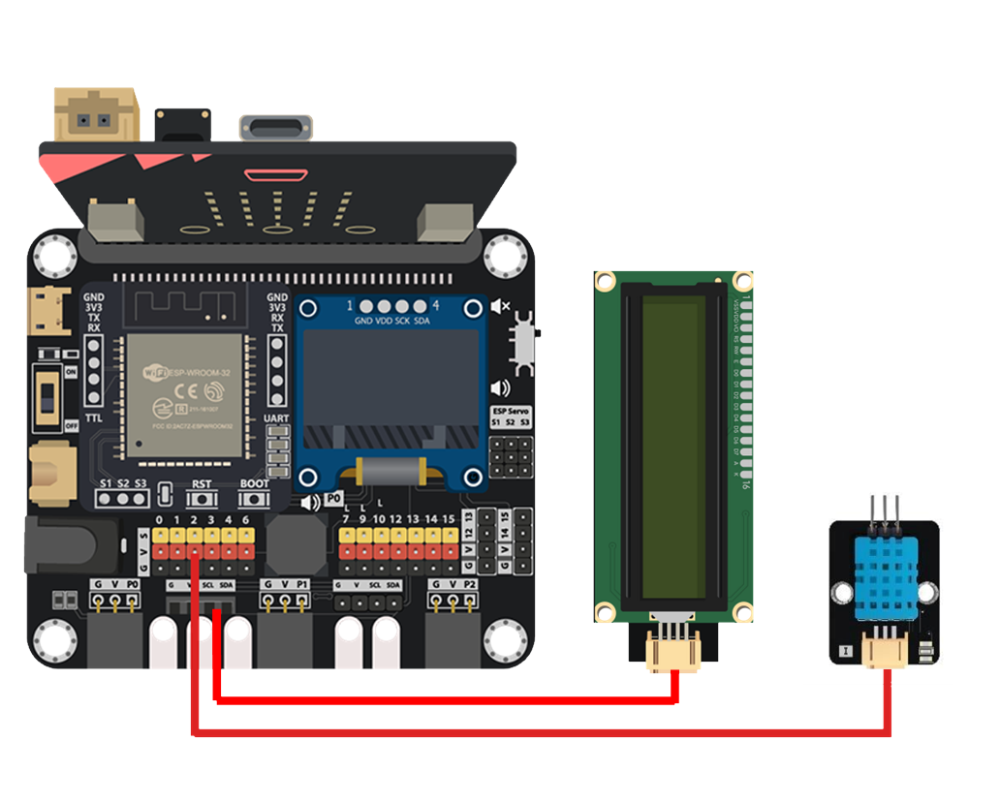

## Programming (MakeCode)

MakeCode: [https://makecode.microbit.org/\_f1EWY3VVEF9T](https://makecode.microbit.org/_f1EWY3VVEF9T)   
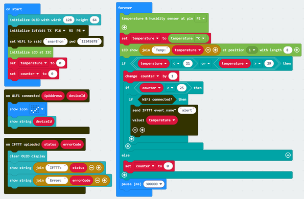

## IoT (IFTTT)

1. Go to [https://ifttt.com](https://ifttt.com), register an account and login to the platform.

2. On the top right menu, click “Create”.

3. Create tigger by:  

* Select “This”.  

* Select Smarthon IoT (micro:bit).  

* Select “IoT:bit was triggered”.  

* Input IoT:bit’s device ID and Trigger Command “alert”.  

* Click “Create trigger”.

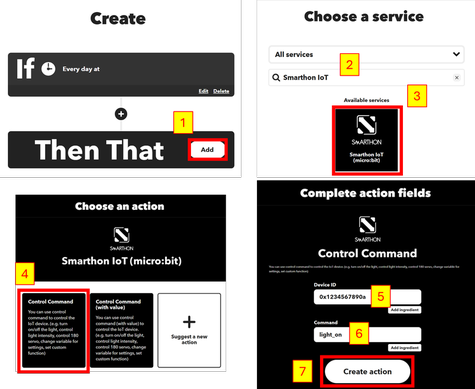

4. Create action by: 
 
* Select “That”.  

* Select Email.  

* Select “Send me an email”.  

* Input email Subject and Body.  

* Click “Create action”.

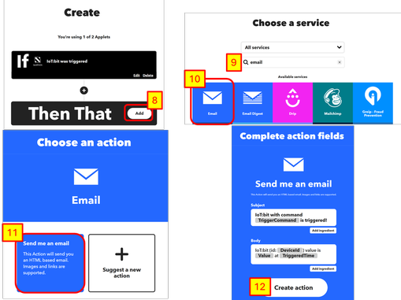

## Result

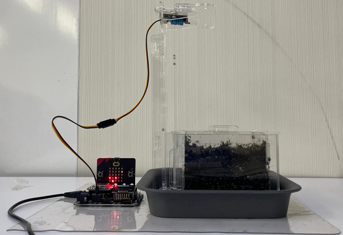
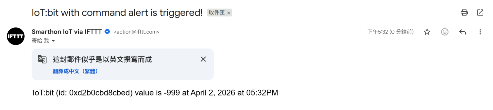

