# IoT Case 07: Automated Lighting Schedule Control

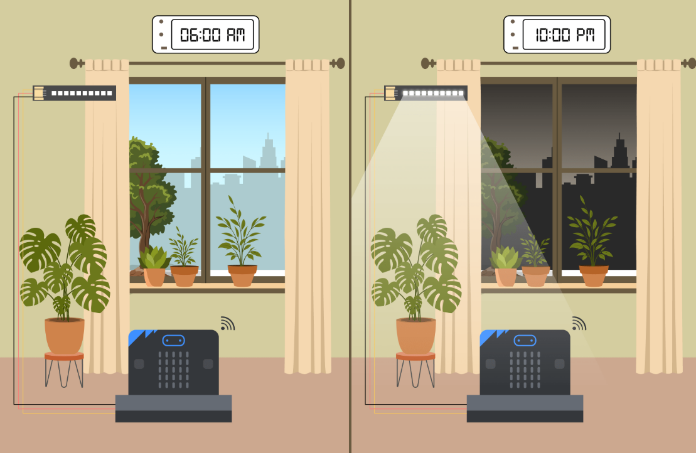
## Goal

Create a system that automatically provides light to the plants according to a schedule controlled from the cloud.

## Background

<b>Why do I need to schedule the light time? </b>

Each type of plant requires a different amount of light. Some need more sunlight, while others thrive with less or even prefer to avoid direct exposure. Improper lighting can hinder a plant’s growth or even cause it to die.

<b>Why need to put the schedule and control it via the cloud?</b>

Plants need consistent care, but people living in cities often lead busy lives and cannot tend to their plants every day. By using cloud control, users can monitor and manage lighting conditions remotely, ensuring their plants receive proper care even when they are away.

## Part List

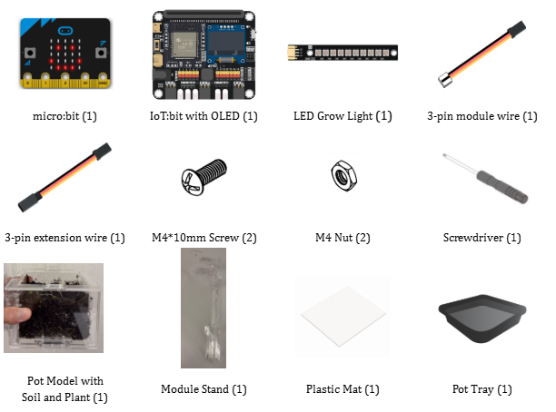

## Assembly Steps
<!-- 
1. To start with, build the plant pot model with soil and seedling.

2. Connect the Module Stand with the Pot base.

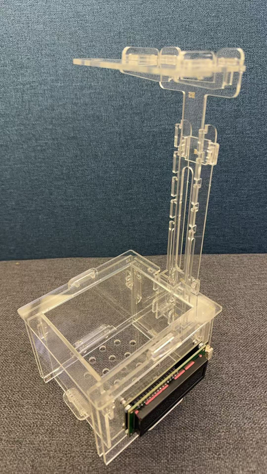

3. Insert screw with grow light led to part C1.

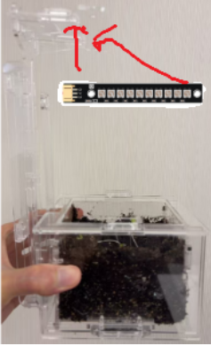

4. Put the model onto the pot tray and plastic mat. Completed\!

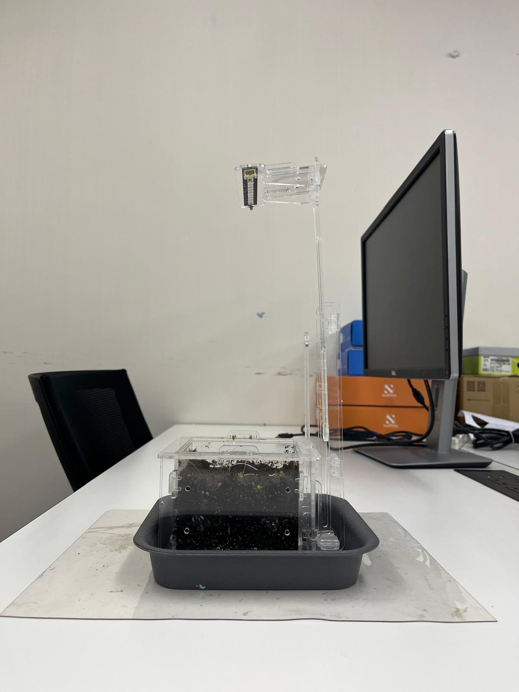
 -->
## Hardware Connection

1. Connect LED Grow Light to P1.

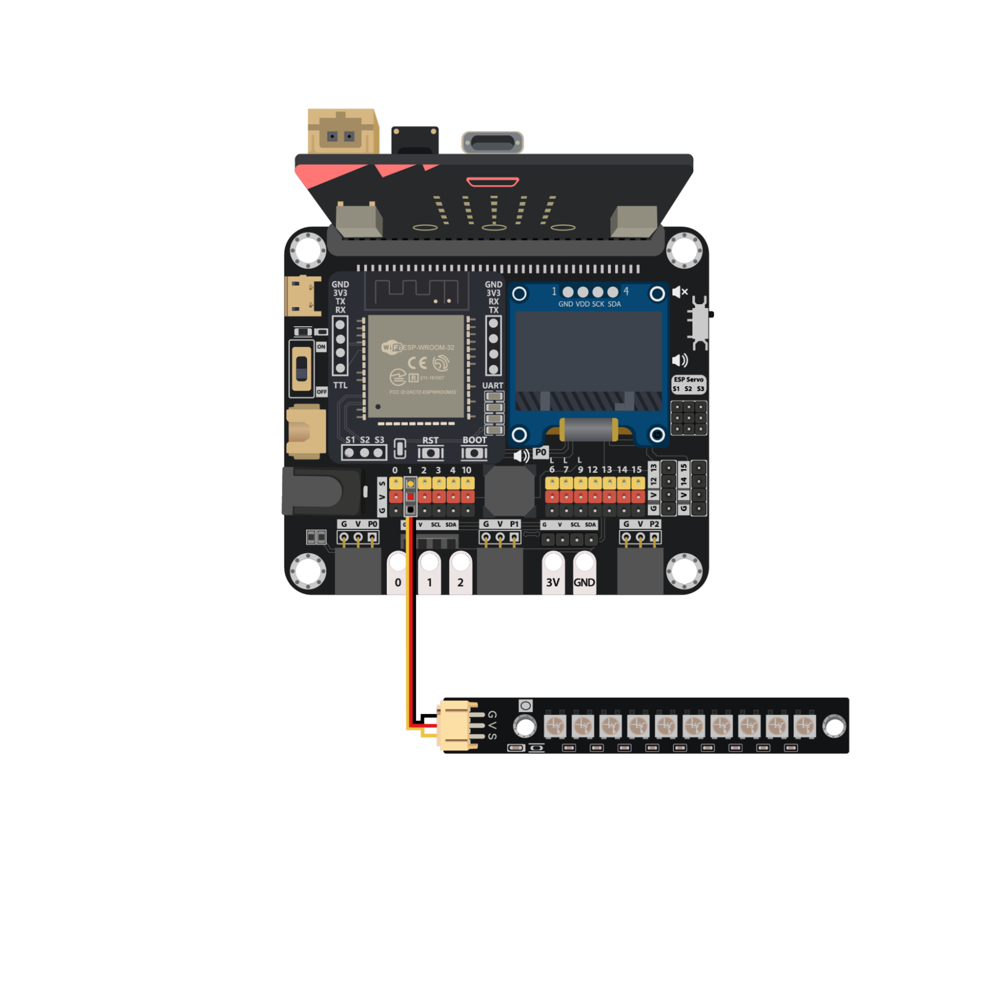

## Programming (MakeCode)

MakeCode: [https://makecode.microbit.org/\_0KE9J63x5Ezr](https://makecode.microbit.org/_0KE9J63x5Ezr)   
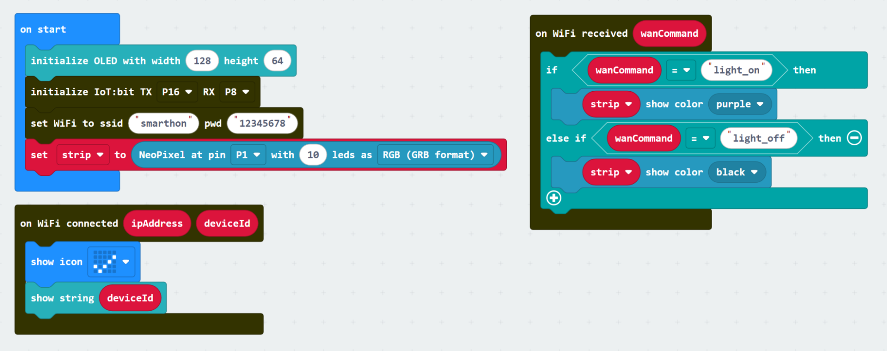

## IoT (IFTTT)

1. Go to [https://ifttt.com](https://ifttt.com), register an account and login to the platform.

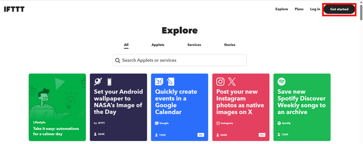

2. On the top right menu, click “Create”.

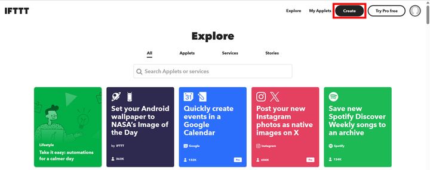

3. Create tigger by:  

* Select “This”.  

* Select Date & Time.  

* Select “Every day at”.  

* Input the trigger time (6 PM).  

* Click “Create trigger”.

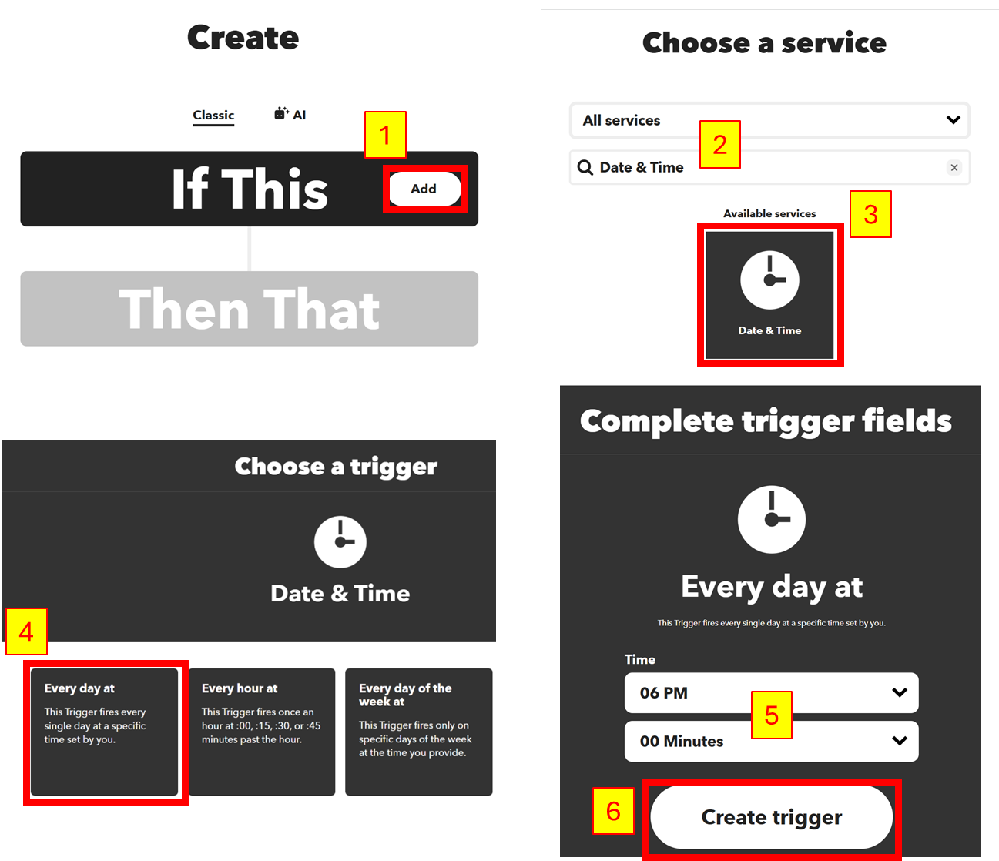

4. Create action by:  

* Select “That”.  

* Select Smarthon IoT (micro:bit).
  
* Select “Control Command”.  

* Input IoT:bit’s device ID and Command “light\_on”.  

* Click “Create action”.

5. Repeat Step 2 - 4 to create another applet that turns off the grow light by sending the command “light_off” to micro:bit at 1 AM every day.

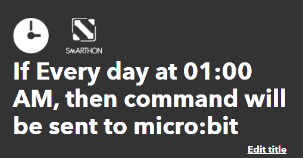

## Result

The LED Grow Light turns on when IFTTT sends the command “light\_on” to the micro:bit at 6:00 PM every day.  
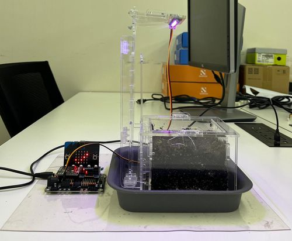

The LED Grow Light turns off when IFTTT sends the command “light\_off” to the micro:bit at 1:00 AM every day.  
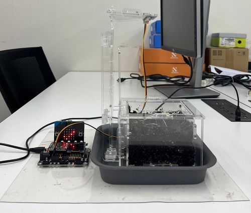
