# IoT Case 08: Weather-Adaptive Irrigation (Outdoor)
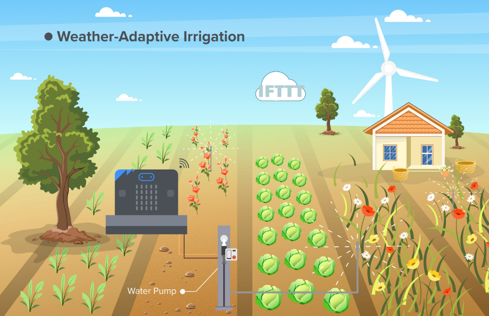
## Goal

Create an irrigation system that automatically adjusts the watering schedule according to the weather.

## Background

<b>What is Weather Adjustment Irrigation?</b>

A Weather Adjustment Irrigation system is an automated solution designed to optimize watering schedules based on real-time weather conditions. By automatically adjusting the watering frequency according to rainfall, users can ensure that their plants receive the right amount of water. This system not only conserves water but also promotes healthier plant growth.

<b>Weather Adjustment Irrigation Operation</b>

In this case, we use a fog module to simulate the irrigation process.

The board connects to the Wi-Fi and displays a tick signal when successful. When there are changes in the current weather conditions, the IFTTT applet will send a signal to the IoT board. After receiving the signal, the board will skip the next scheduled irrigation.

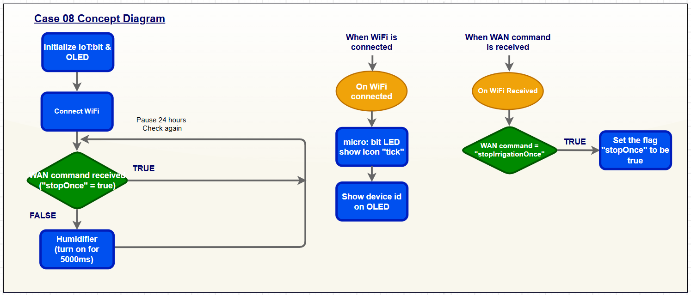

## Part List

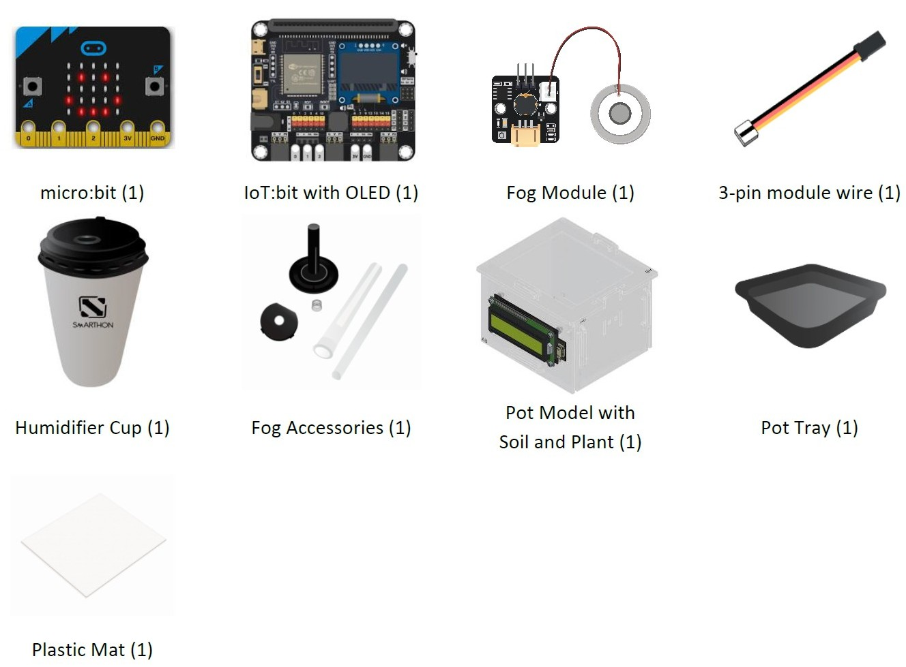

## Assembly Steps

Step 1 

Step 1. To start with, build the plant pot model with soil and seedling. 

Step 2 

Connect the Fog Module with a 3-pin module wire. Install the Fog Module and Fog Accessories as shown in the pictures. (The detail sheps is shown on the pictures. Please follow the order of the pictures from left to right to do this step)
 

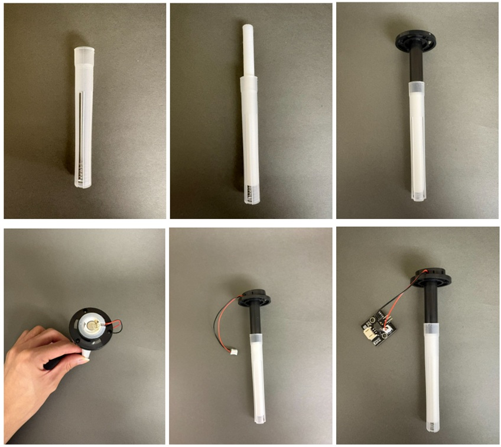

Step 3 

Put the Fog Module and Fog Accessories components into the Humidifier Cup. 

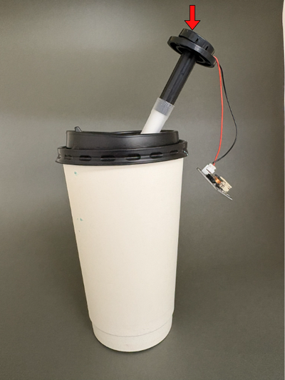

Step 4 

Put the model onto the pot tray and plastic mat. Completed! 

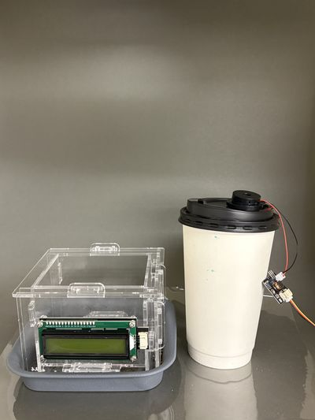

## Hardware Connection

1. Connect Fog Module to P0.
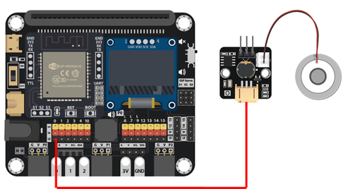

## Programming (MakeCode)

MakeCode: [https://makecode.microbit.org/\_2kRdtYeAEThv](https://makecode.microbit.org/_2kRdtYeAEThv)   
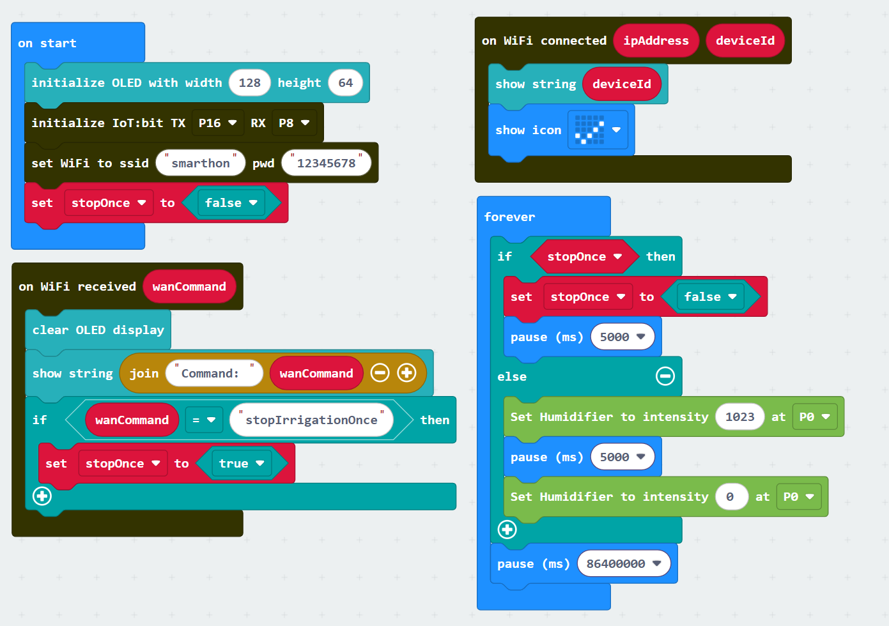

## IoT (IFTTT)

1. Go to [https://ifttt.com](https://ifttt.com), register an account and login to the platform.

2. On the top right menu, click “Create”.

3. Create tigger by:  

* Select “This”.  

* Select Weather Underground.  

* Select “Current condition changes to”.  

* Input the Current condition (Rain) and location. 
 
* Click “Create trigger”.

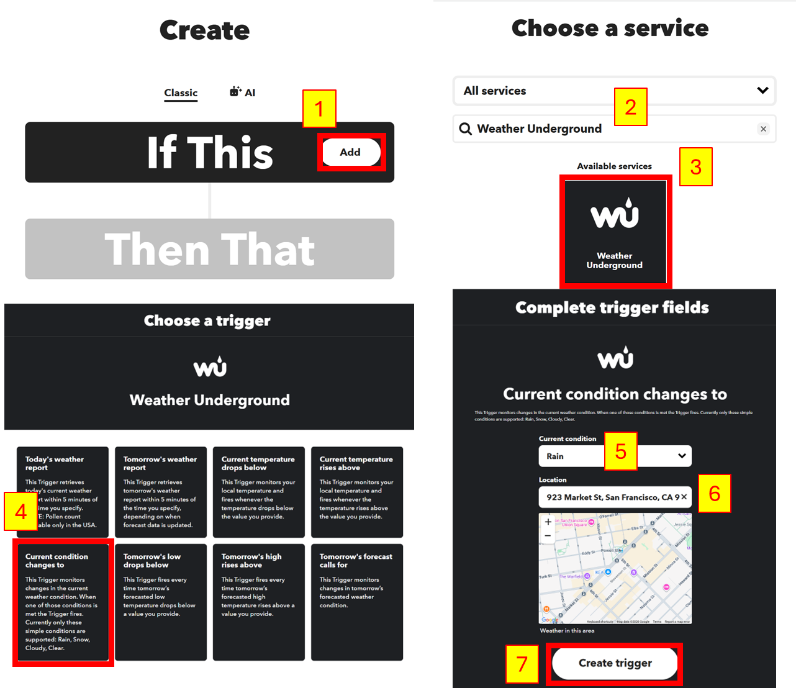

4. Create action by:  

* Select “That”.  

* Select Smarthon IoT (micro:bit).  

* Select “Control Command”.  

* Input IoT:bit’s device ID and Command “stopIrrigationOnce”. 
 
* Click “Create action”.

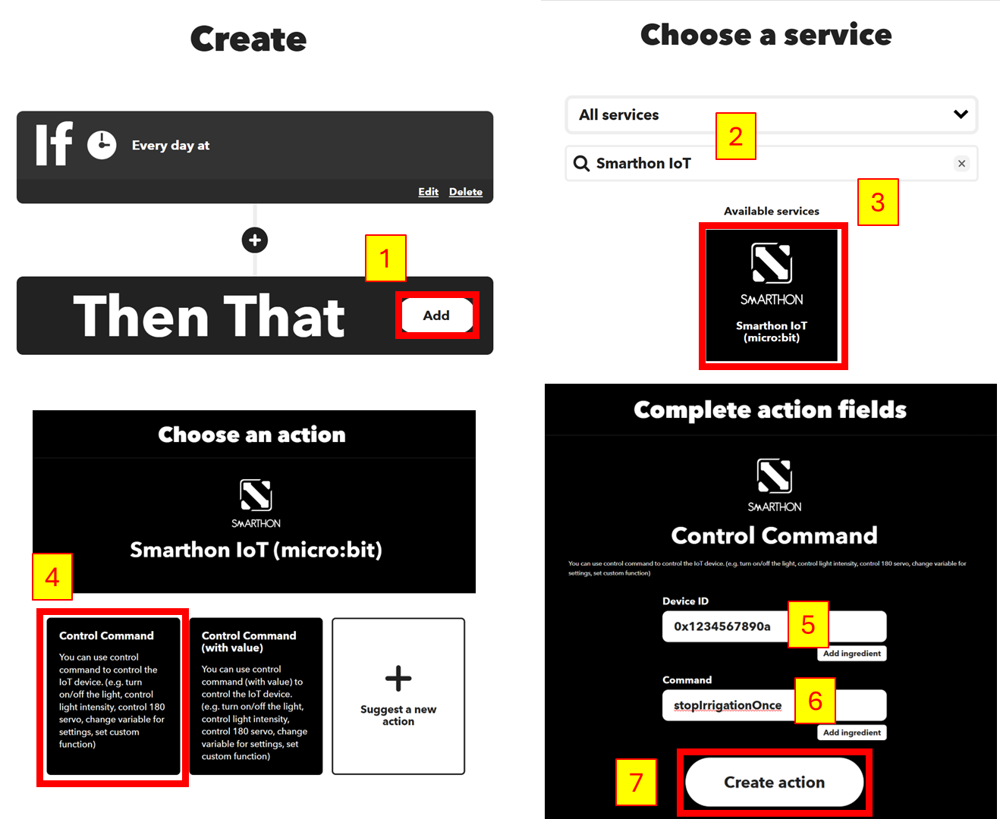

## Result

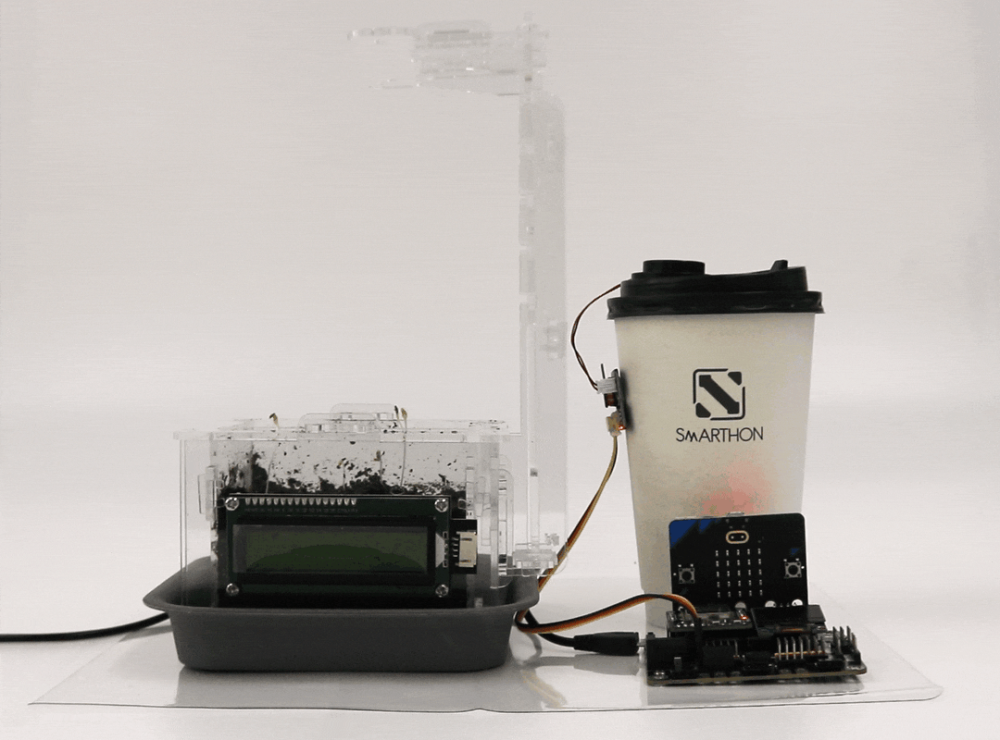
