# IoT Case 09:  Remote Water Pump Control

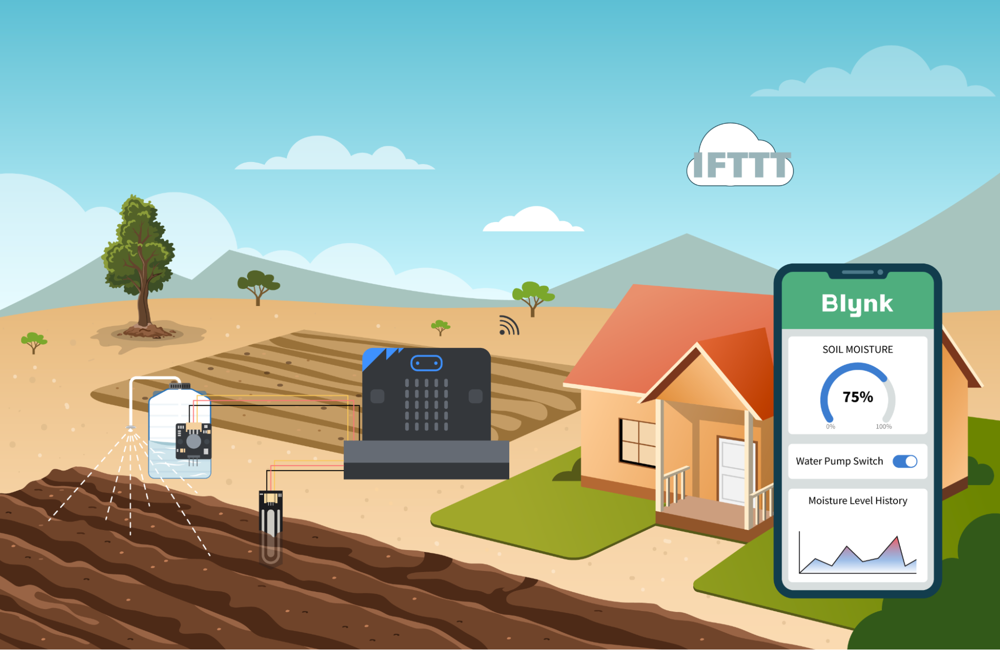

## Goal

Use Blynk to create a mobile app for monitoring soil moisture levels and remotely controlling the water pump for irrigation. 

## Background

<b>What is Blynk?</b>

Blynk is a platform designed for creating Internet of Things (IoT) applications, enabling users to connect and control hardware devices remotely. With Blynk, users can easily build mobile applications by utilizing a drag-and-drop interface to customize their app's design. Users can employ pre-built widgets to monitor sensors, control actuators and visualize data in real time. 

<b>Mobile App Soil Moisture Control Operation</b>

After setting up the model with the water pump and soil moisture sensor, it will connect to the internet and communicate with Blynk via a token. The soil moisture level measured by the sensor will be sent to Blynk, while Blynk will send the switch signal to the model for controlling the water pump.

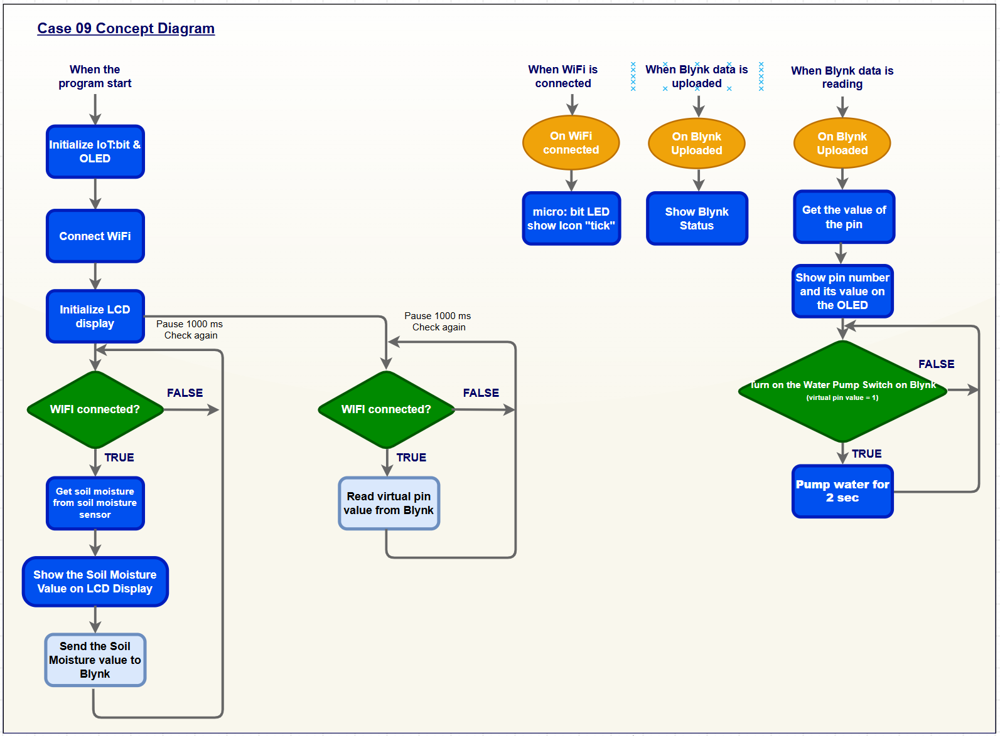

## Part List

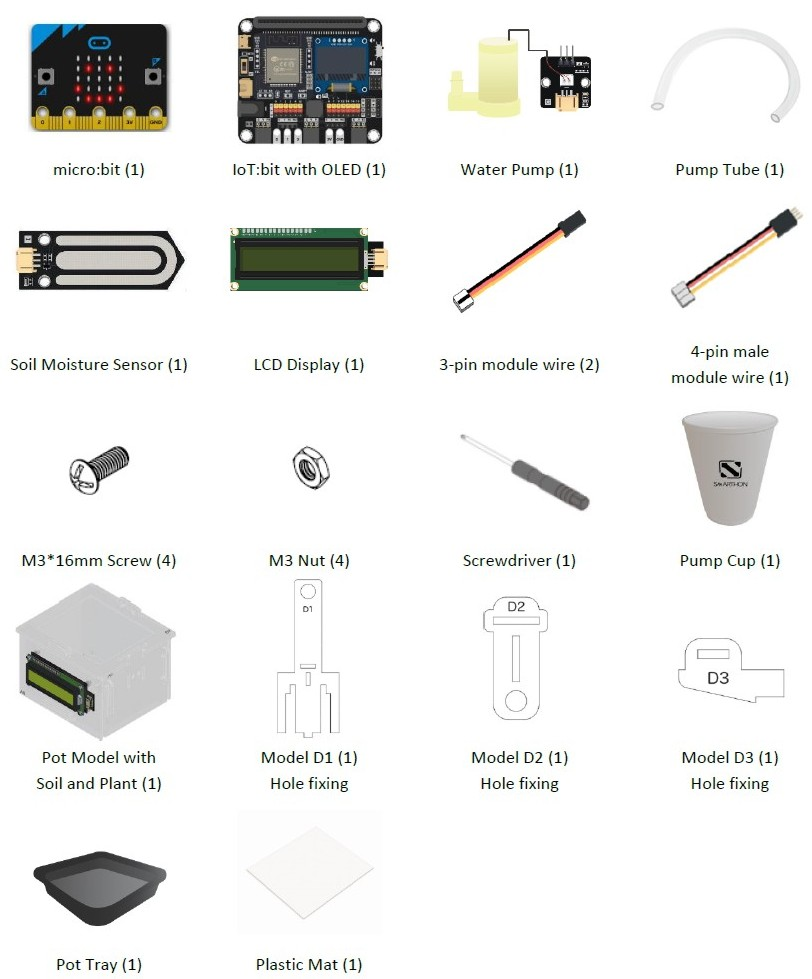

## Assembly Steps

Step 1 
To start with, build the plant pot model with soil and seedling. Install the LCD Display during the build. 

Step 2 
Assemble D3 with D1. 

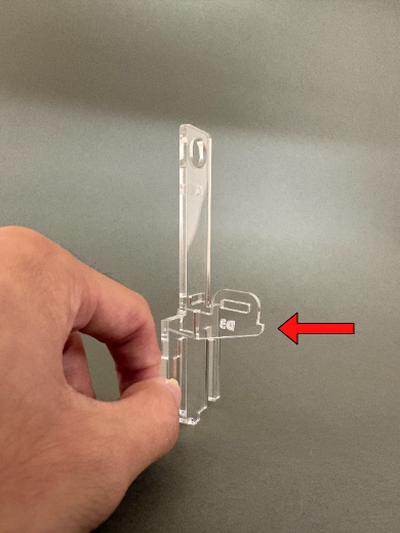

Step 3 
Assemble D2 with the above part. 

Step 4 
Fixed it with two F. 

Step 5 
 Assemble the above part with the plant pot. 

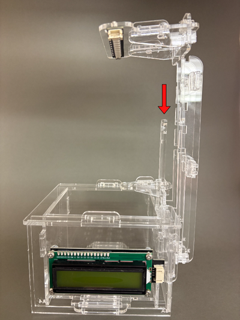

Step 6 
Connect the water pump with the pump tube. 

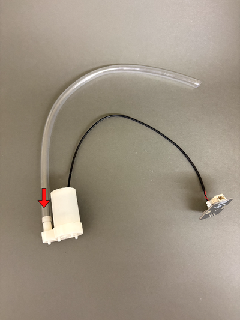

Step 7 
Put the water pump into the pump cup, then insert the pump tube between D1 and D2 as shown in the picture. 

Step 8 
Connect the soil moisture sensor with a 3-pin module wire and put it into the soil. 

Step 9 
Put the model onto the pot tray and plastic mat. Completed! 

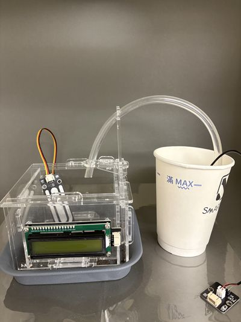

## Hardware Connection

1. Connect Water Pump to P0.  
2. Connect Soil Moisture Sensor to P1.  
3. Connect LCD Display to I2C.

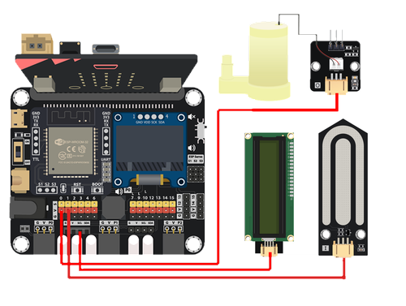

## Programming (MakeCode)

MakeCode: [https://makecode.microbit.org/\_gxY2b6FhcHmp](https://makecode.microbit.org/_gxY2b6FhcHmp)   
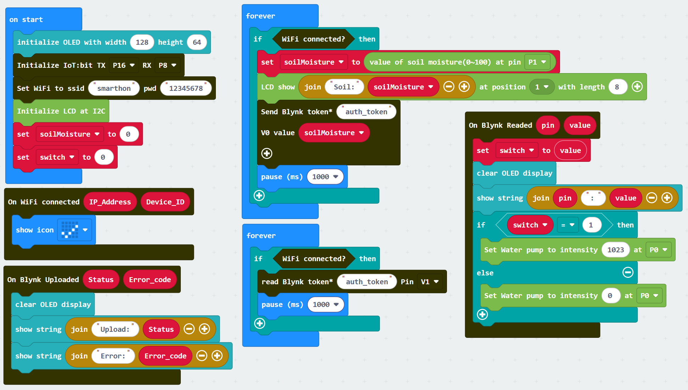

## IoT (Blynk)

### Part 1: Setup Blynk

1. Go to [https://www.blynk.io](https://www.blynk.io), register an account and login to the platform. 

2. On the left menu, click “Developer Zone” \> “New Template”.

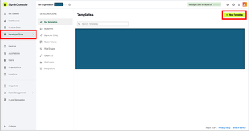

3. Create a new template by:  

* Input name “Soil Moisture Control”.  

* Click “Done”.

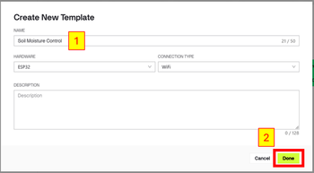

4. On the left menu, click “Datastreams” \> “New Datastream” \> “Virtual Pin”.

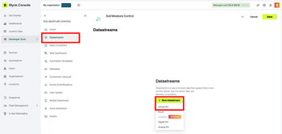

5. Add the first Virtual Pin by:  

* Input name “Soil Moisture”.  

* Set Max to 100\.  

* Click “Create”.

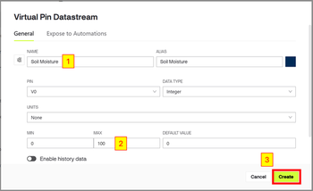

6. Click “New Datastream” \> “Virtual Pin”. Add the second Virtual Pin by:  

* Input name “Water Pump Switch”.  

* Click “Create”.

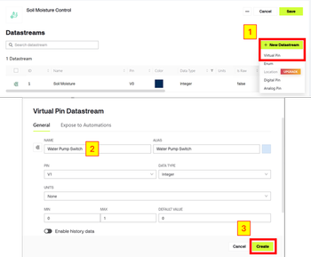

7. On the left menu, click “Web Dashboard”. Add a Gauge for displaying detected soil moisture value by:  

* Drag a Gauge to the dashboard.  

* Hover over the added Gauge and click “...” \> Settings“.  

* Select Soil Moisture (V0).  

* Click “Save”.

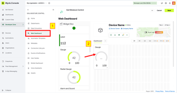
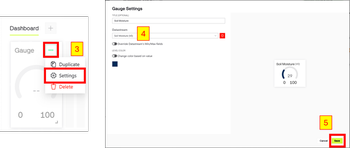

8. Add a Switch for controlling water pump by:  

* Drag a Switch to the dashboard.  

* Hover over the added Switch and click “...” \> Settings“.  

* Select Water Pump Switch (V1).  

* Click “Save”.

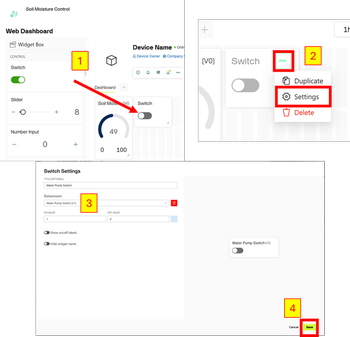

9. Click “Save” to save the dashboard configuration.

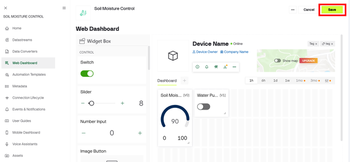

10. On the left menu, click “Devices” \> “New Device” \> “From template”.

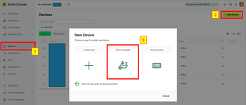

11. Create a device with the template by:  

* Select template “Soil Moisture Control”.  

* Click “Create”.

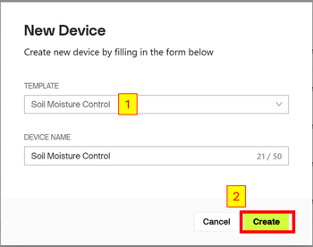

12. Copy the Auth Token of the device for programming. You may also find the Auth Token by clicking “Devices” on the left menu.

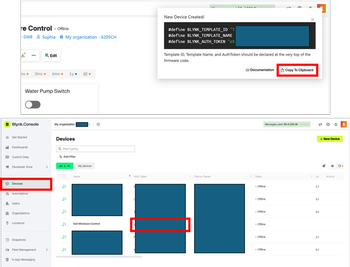

### Part 2: Install and Setup the Blynk App on Smartphone

1. Go to Play Store or App Store to search and download the Blynk app.

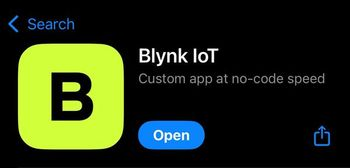

2. Login to your Blynk account.

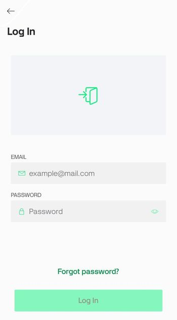

3. Click the device “Soil Moisture Control”.

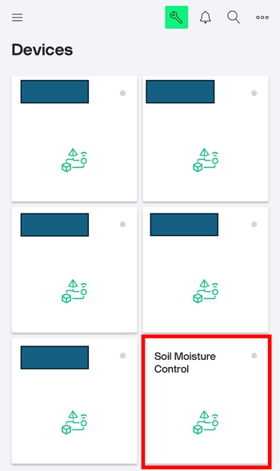

4. Click the green button at the top to open the mobile dashboard edit page. Add a Gauge to display detected soil moisture value by:  

* Click the green button at the button to open the widget box.  

* Select Gauge.  

* Click the added Gauge to open its settings.  

* Select Soil Moisture \[v0\] for datastream.  

* Click the top left button to return to the edit page.

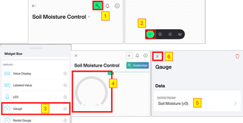

5. Add a Switch to control water pump by:  

* Click the green button at the button to open the widget box.  

* Select Switch.  

* Click the added Switch to open its settings.  

* Select Water Pump Switch \[v1\] for datastream.  

* Click the top left button to return to the edit page.

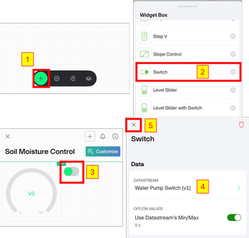

6. Click the top left button to close the dashboard edit page.

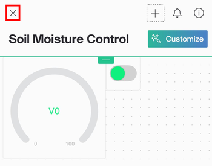

## Result

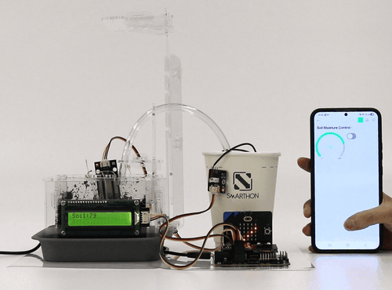

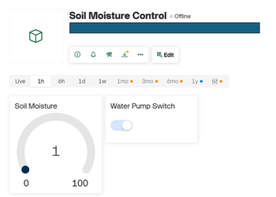

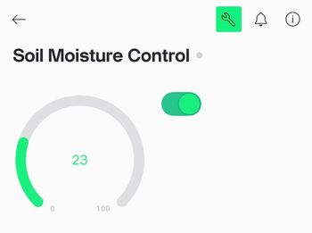

