# AIoT Case 10:  Generating growth AI report

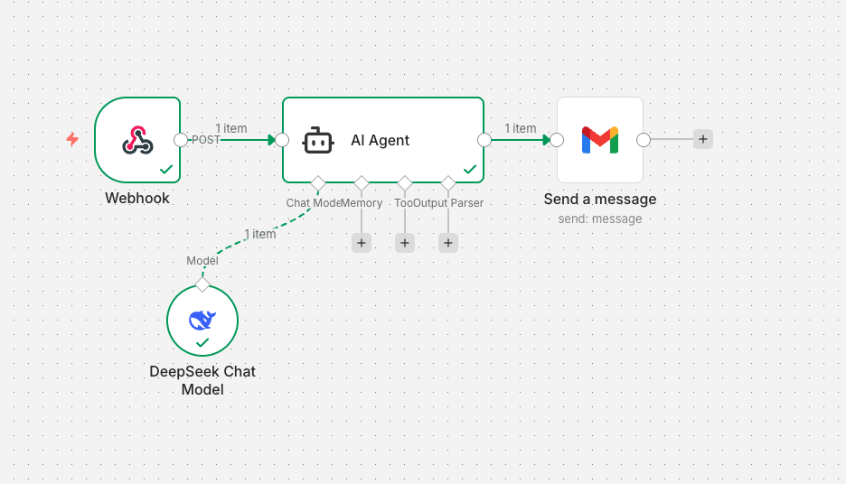

## Goal

By using n8n, we can connect to AI Agents to analyze plant growth status, generate corresponding reports, and send them to users via email.

## Background

<b>How to Use n8n to Access AI Model for Plant Growth Monitoring</b>

n8n is an automation tool designed for connecting AI models and IoT devices, enabling users to monitor plant growth status and generate analysis reports automatically. With n8n, users can easily build automation workflows by utilizing a drag-and-drop interface to customize the process. Users can employ built-in nodes to access AI models, collect plant data and generate structured reports automatically.

<b>N8n AI Plant Monitoring and Report Generation Operation</b>

After setting up the workflow with the data collection node and AI model node, it will connect to the internet and communicate with the AI model via an API key. The plant growth data collected by the node will be sent to the AI model, while the AI model will return the analysis result to n8n for generating a growth report.

## Part List

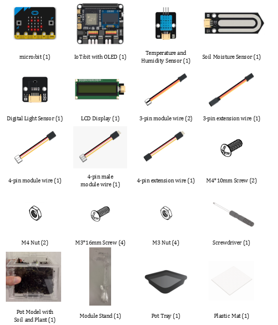

## Assembly Steps
<!-- 
6. To start with, build the plant pot model with soil and seedling. Install the LCD Display during the build.

7. Connect the Module Stand with the Pot base.

8. Connect the Temperature and Humidity Sensor and Digital Light Sensor with a 3-pin and 4-pin module wire respectively. Install them on part C1, with the Digital Light Sensor above and the Temperature Humidity Sensor below the part.

9. Connect the soil moisture sensor with a 3-pin module wire and put it into the soil.

10. Put the model onto the pot tray and plastic mat. Completed\!

 -->

## Hardware Connection

1. Connect Temperature and Humidity Sensor to P1.  
 
2. Connect Soil Moisture Sensor to P2.  
 
3. Connect LCD Display to I2C.  
 
4. Connect Digital Light Sensor to I2C.

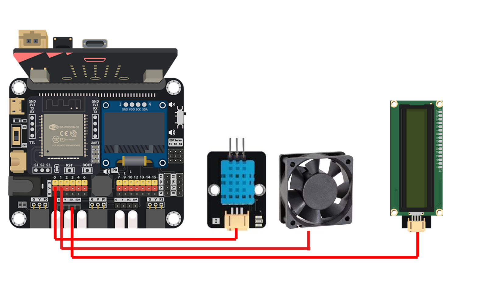

## Programming (MakeCode)

MakeCode: [https://makecode.microbit.org/_UAWUtJhhTRkX ](https://makecode.microbit.org/_UAWUtJhhTRkX)   

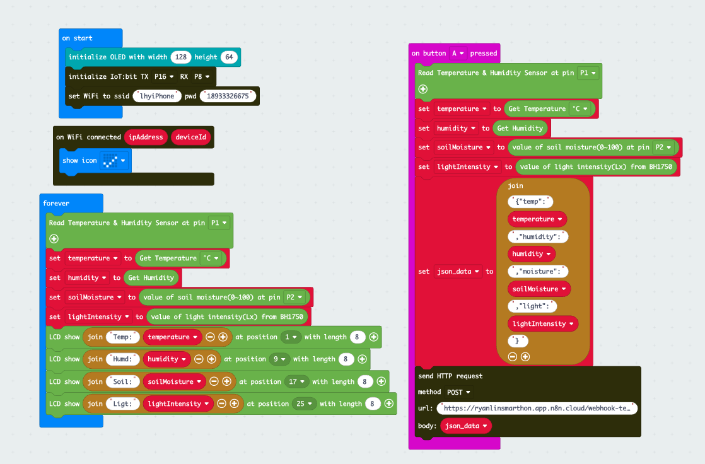

## IoT (n8n)

1. Go to [https://n8n.io/](https://n8n.io/)  register an account and login to the platform.

2. Click “Create workflow”.

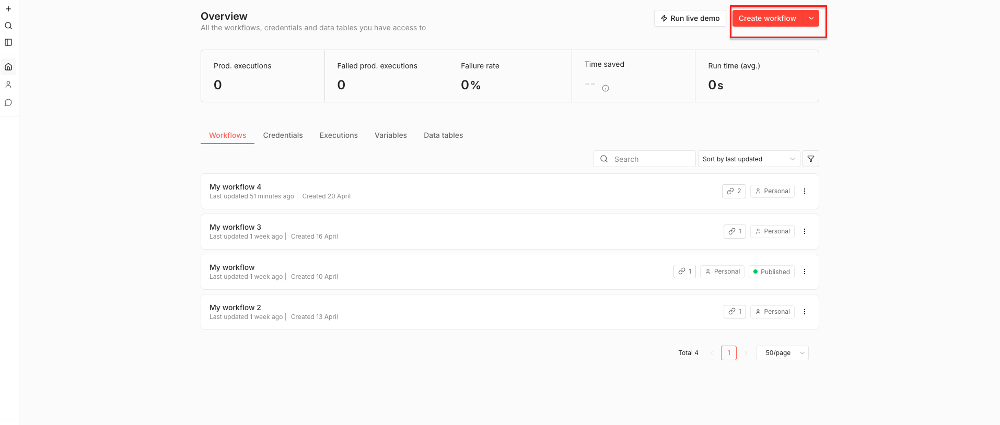

3. Create first step by:  

* Select “add first step”.  

* Search “webhook”  

* Click it  

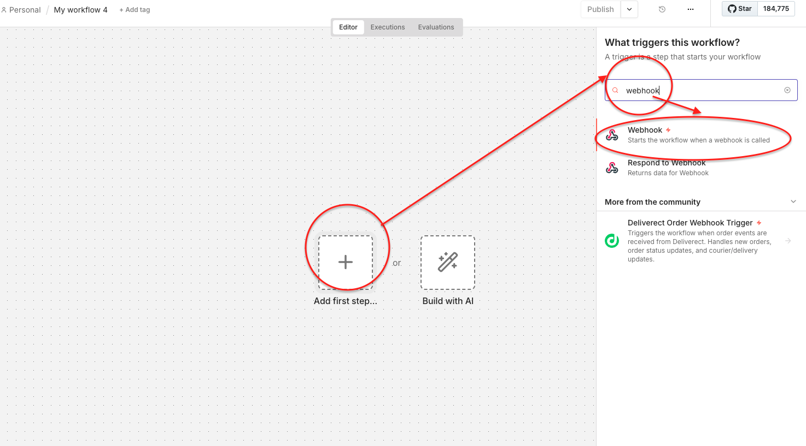

4. Configure parameters:  

* HTTP METHOD:POST

* PATH:PlantGrowthStatusReport

Remember to paste the URL enter the makecode block.

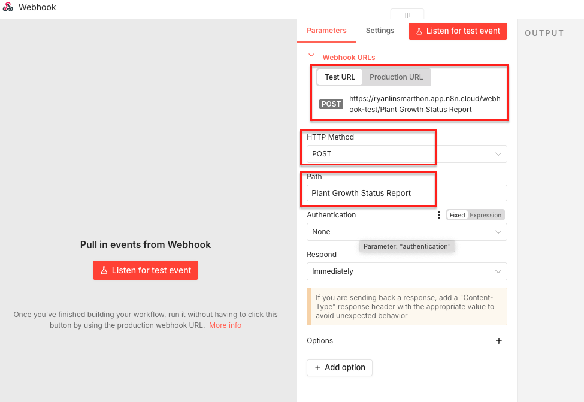

5. Configure AI Agent

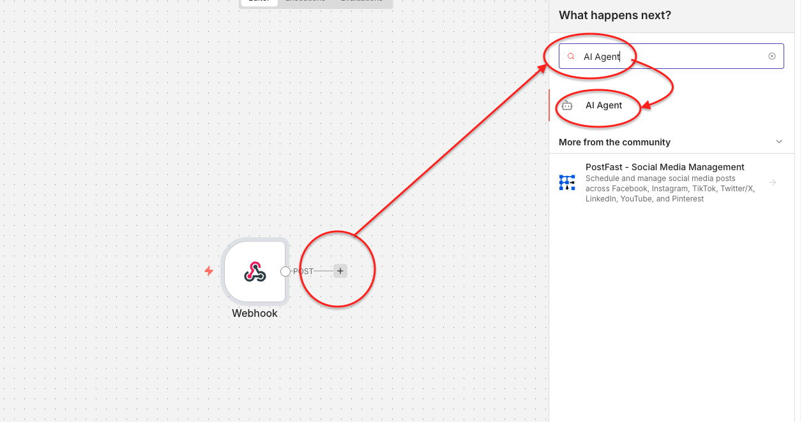

6. Configure AI Agent Parameters  

* Source for Prompt(user Message): Click “ Define below ”  

* Prompt ( user Message ): Paste the prompt:

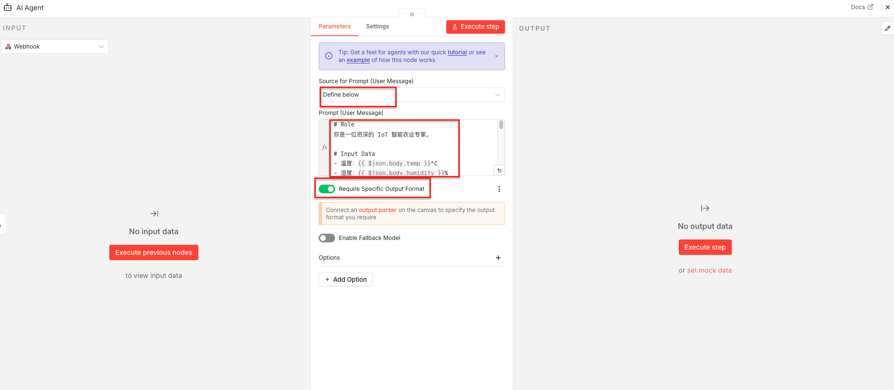

7. Then choose the LLM (Choose Deepseek as an exemple)  

* Click “Chat Model”

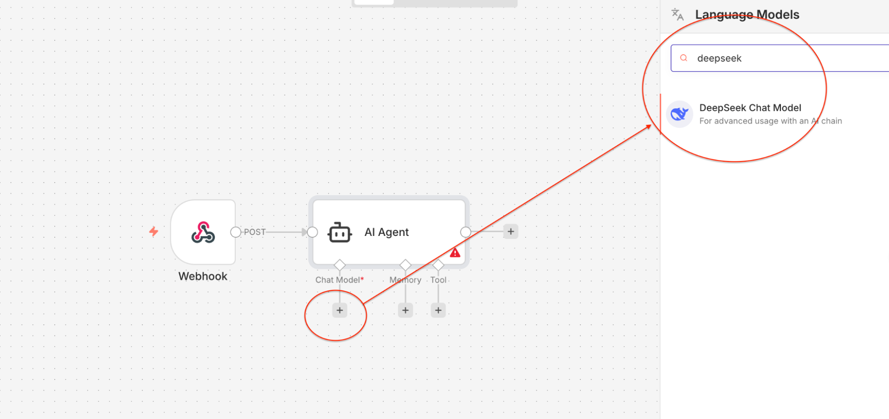
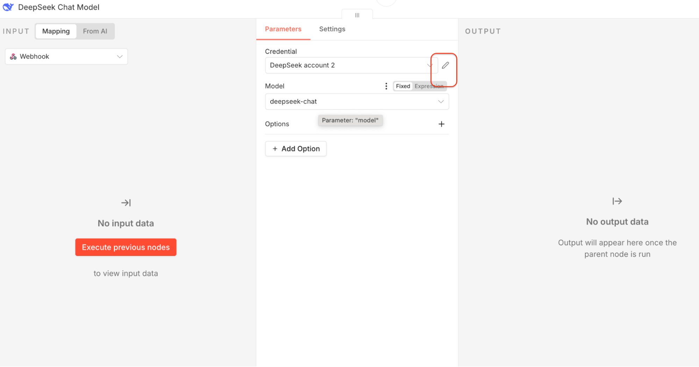

8. Configure LLM  

* Paste the API key here, you will see Connection tested successfully

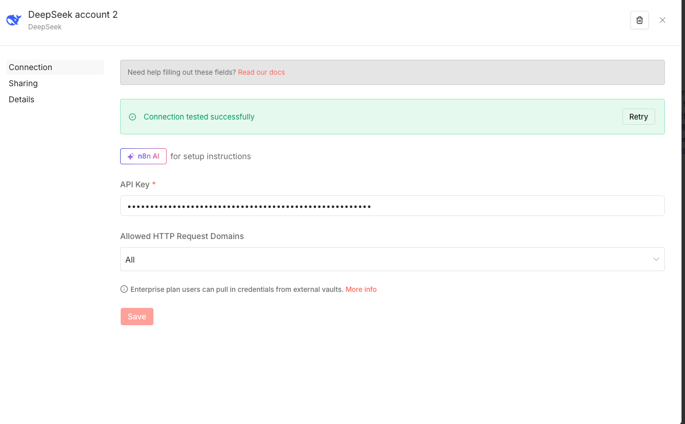

9. Configure Gmail message  

* Choose “send a message” ,then follow the steps:  

* Credential:login the email  

* Operation:Send  

* To:choose you Email  

* Subject:micro:bit IoT Bit 

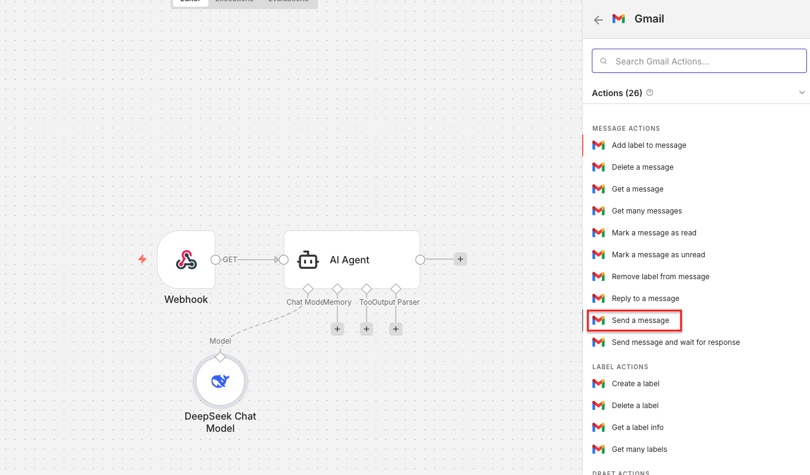
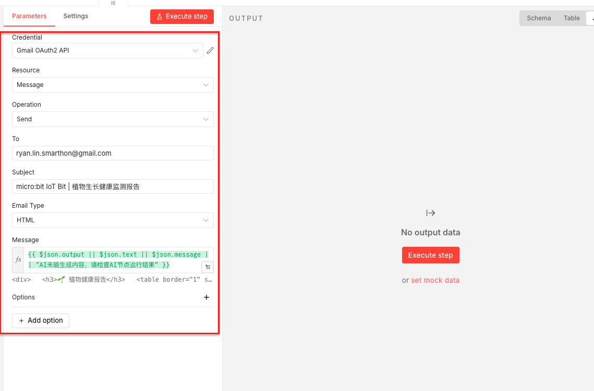

10. Completed

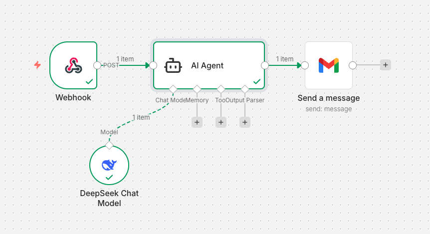

## Result

Download the program to the micro:bit. Click “Execute workflow” in n8n. Press Button A on the micro:bit. After data is uploaded to the webhook, AI analysis will be completed automatically, and a growth report will be sent to your email.  
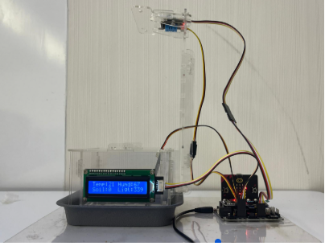

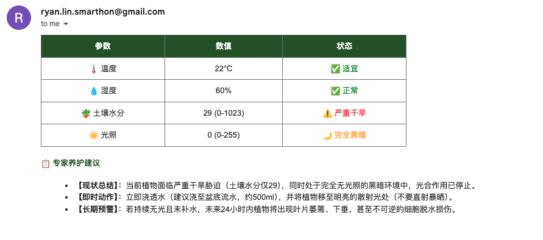
