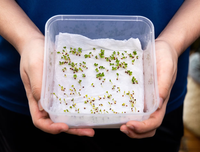
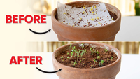
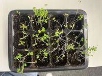
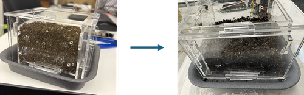

# How to Plant

There are three primary methods of planting: starting from seeds, transplanting seedlings, and propagating from mature plants. Each method offers different advantages depending on the plant species and growth objectives.

## Method 1: From Seeds

1. Put soil into the pot.  
2. Thoroughly water the soil.  
3. Make indentations of around 1.5 cm deep in the soil, spacing them evenly.  
4. Place seeds gently into each indentation.  
5. Cover the seeds lightly with a thin layer of soil.  
6. Firm the soil gently around the seeds to ensure good contact.  
7. Water the soil carefully to moisten without washing the seeds away.  
   

## Method 2: Transplanting Seedlings

1. Put soil into the pot.  
2. Dig a hole about 3 cm deep in the soil.  
3. Use a spoon to get a seedling gently.  
4. Gently place the seedling into the hole.  
5. Firm the surrounding soil around the seedling.  
6. Thoroughly water the soil.

  

## Method 3: Propagating From Mature Plants

1. Put soil into the pot.  
2. Thoroughly water the soil.  
3. Select a healthy, mature plant and carefully take cuttings or divide the plant into sections, making sure each cutting or division has roots or nodes for new growth.  
4. Dig holes about 1 inch deep in the soil, spacing each hole about 5 cm apart.  
5. Gently place the cuttings or divisions into the holes.  
6. Firm the surrounding soil around each cutting or division.

## Points to Note
 
1. Before sowing seeds, optionally soak them in warm water for 4-6 hours to speed up germination. Then, dampen a paper towel with water in a shallow plate and place the soaked seeds on top. Cover with a thin perforated plastic sheet. The seeds will germinate, after which you can transplant them to pots using Method 1 for further growth.  
  
  

 
2. When planting from seeds, consider using a seedling pot to ensure successful germination. Once the seeds have sprouted, you can transplant the seedlings into larger pots following Method 2 for continued growth.  
  
  
 
3. When planting with new soil, water it thoroughly first to provide enough moisture for healthy plant growth. Ensure the soil fully absorbs the water before proceeding to the next step. Its volume will shrink noticeably afterward, often by about half the original amount.  
  

## Ideal Growth Conditions

Each type of plant has different growth conditions at various stages to ensure optimal development. The following are the ideal growth conditions for lettuce, choi sum and mint respectively.

### Lettuce

| Stage | Temperature (°C) | Light | Humidity | Soil Condition |
| :---- | :---- | :---- | :---- | :---- |
| Germination \[5-14 days\] | 15–22 Optimal: 18–20 | Avoid direct sunlight | High | Well-drained |
| Seedling \[2-3 weeks\] | 15–22 | Full / Partial sun | Moderate | Keep fertile |
| Growth \[4-10 weeks\] | 12–24 Optimal: 15–22 | ≥ 5 hours of full sunlight | Moderate | Well-drained and fertile |

### Choi Sum

| Stage | Temperature (°C) | Light | Humidity | Soil Condition |
| :---- | :---- | :---- | :---- | :---- |
| Germination \[5-10 days\] | 25-30 | Sufficient sunlight | High | Well-drained |
| Seedling \[2-4 weeks\] | 15–25 | ≥ 4 hours of sunlight | Moderate | Keep fertile |
| Growth \[30-50 days\] | Optimal: 15–20 | Full sun | Moderate | Well-drained and fertile |

### Mint

| Stage | Temperature (°C) | Light | Humidity | Soil Condition |
| :---- | :---- | :---- | :---- | :---- |
| Germination \[7-21 days\] | 18–25 Optimal: 20-25 | Avoid direct sunlight | High | Well-drained |
| Seedling \[2-4 weeks\] | 15–30 | Full / Partial sun | High |  |
| Growth \[40-90 days\] | 20–30 Optimal: 25–30 | Full sun | High | Keep fertile |